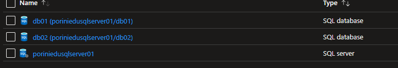

# Cross Azure Database Query

- [Cross Azure Database Query](#cross-azure-database-query)
  - [Creation Azure Resources of demo environment (with Powershell)](#creation-azure-resources-of-demo-environment-with-powershell)
  - [Demo](#demo)


## Creation Azure Resources of demo environment (with Powershell)

 ``` Powershell

# parameters
$subscriptionId = xxxx

$resourceGroupTarget ='PoriniSqlEdu01'
$location = "NorthEurope"

$sqlServerName = 'poriniedusqlserver01';
$sqlAdminLogin = 'Student00';
$sqlPassword ='SierraTango19$$';
$startIp = "0.0.0.0";
$endIp = "255.255.255.255";

$sqlDataBaseName1 ='db01';
$sqlDataBaseName2 ='db02';


# Connect to Azure
Connect-AzAccount
Set-AzContext -SubscriptionId $SubscriptionId 


# Creation of Resource Group

    #Valorizzo il flag se esiste il resource group
    $Flag = 0;

    $Risorse = Get-AzResourceGroup
    foreach ($a in $Risorse)
    {
        if ($a.ResourceGroupName -eq $ResourceGroupTarget) {$Flag= 1}
    }

    if($Flag -eq 0) {New-AzResourceGroup -Name $resourceGroupTarget -Location $location};


# Creation of Sql Logical Server

      $Flag = 0;
    $servers = Get-AzSqlServer
    foreach ($a in $servers)
        {
            if ($a.ServerName -eq $sqlServerName) {$Flag= 1}
        }

    if($Flag -eq 0) {

        [securestring]$secStringPassword = ConvertTo-SecureString $sqlPassword -AsPlainText -Force
        [pscredential]$cred = New-Object System.Management.Automation.PSCredential ($sqlAdminLogin,$secStringPassword)


           $Parameters = @{
                ResourceGroupName = $resourceGroupTarget
                Location = $location     
                ServerName = $sqlServerName
                SqlAdministratorCredentials = $cred
            }

          $server = New-AzSqlServer @Parameters

          #Apertura Firewall sull'intervallo IP address
            $Parameters = @{
                ResourceGroupName = $resourceGroupTarget   
                ServerName = $sqlServerName
                FirewallRuleName = "AllowedIPs"
                StartIpAddress = $startIp
                EndIpAddress = $endIp

            }

    $serverfirewallrule = New-AzSqlServerFirewallRule @Parameters

    }


# Creation of Azure Sql Databases

   # first database
    $Flag = 0;
    $dbs = Get-AzSqlDatabase -ResourceGroupName $resourceGroupTarget -ServerName $sqlServerName

    foreach ($a in $dbs)
        {
            if ($a.DatabaseName -eq $sqlDataBaseName1) {$Flag= 1}
        }

    if($Flag -eq 0) {


            $Parameters = @{
                ResourceGroupName = $resourceGroupTarget   
                ServerName = $sqlServerName
                Edition = 'Standard'
                DatabaseName = $sqlDataBaseName1
                RequestedServiceObjectiveName = 's0'
                SampleName =  "AdventureWorksLT"
                LicenseType = "LicenseIncluded"
            }

        $database1 = New-AzSqlDatabase @Parameters

    }


    # second Database
    $Flag = 0;
    $dbs = Get-AzSqlDatabase -ResourceGroupName $resourceGroupTarget -ServerName $sqlServerName

    foreach ($a in $dbs)
        {
            if ($a.DatabaseName -eq $sqlDataBaseName2) {$Flag= 1}
        }

    if($Flag -eq 0) {


            $Parameters = @{
                ResourceGroupName = $resourceGroupTarget   
                ServerName = $sqlServerName
                Edition = 'GeneralPurpose'
                DatabaseName = $sqlDataBaseName2
                Vcore = 2
                SampleName =  "AdventureWorksLT"
                LicenseType = "LicenseIncluded"
                ComputeGeneration = "Gen5" 
            }

        $database2 = New-AzSqlDatabase @Parameters

    }

 ```

 Resources created



## Demo

 ``` SQL

-- ************* Connection to su DB02

-- Creation of table for test
create table dbo.CrossTable01
(
    Id int identity(1,1), 
    Codice varchar(20), 
    Momento datetime
)
;
GO

Insert into dbo.CrossTable01 values
('Alfa','20210502'),('Bravo','20210601'),('Charlie',getdate());
GO

select * from dbo.CrossTable01;
GO

-- Creation of store procedure for test
create procedure dbo.InsertData @Codice varchar(20)
as
insert into dbo.CrossTable01 (Codice, Momento)
values (@Codice, Getdate());
GO

-- check 
exec  dbo.InsertData 'Zulu';
GO
select * from dbo.CrossTable01;
GO


-- ************* Connection to su DB01

-- Creation of resource to access to DB2 tables

-- Step 1: creation of master key (Mandatory one shot)
CREATE MASTER KEY ENCRYPTION BY PASSWORD = 'Poldo1122$$'; 
GO

-- Step 2: creation of Credentials to access to DB02
CREATE DATABASE SCOPED CREDENTIAL DB02_Cred 
 -- user name and password of a login of external database (DB02)
 WITH IDENTITY = 'student00',  SECRET = 'SierraTango19$$';
GO

 -- Step 3: creation of external datasource to DB02
 CREATE EXTERNAL DATA SOURCE DB02_DataSource WITH 
    (TYPE = RDBMS, 
    LOCATION = 'poriniedusqlserver01.database.windows.net', 
    DATABASE_NAME = 'db02', 
    CREDENTIAL = DB02_Cred 
) ;
GO

-- Step 4: creation of external table (same fields/datatype of tables of external database)
--drop EXTERNAL TABLE  dbo.DB02_CrossTable01b 

CREATE EXTERNAL TABLE dbo.DB02_CrossTable01
( 
Id int, 
Codice varchar(20),
Momento datetime
)
WITH 
( DATA_SOURCE = DB02_DataSource,
  SCHEMA_NAME = N'dbo',  
  OBJECT_NAME = N'CrossTable01',  
) 
;
GO     

-- check

select 'external' as source, name from sys.external_tables;
select 'local' as source, name from sys.tables;
GO

-- Cross query
select * from dbo.DB02_CrossTable01;
GO


insert into dbo.DB02_CrossTable01  -- it does not work
values ('Delta',Getdate())
;

-- execution of remote query on DB02
EXEC sp_execute_remote  
N'DB02_DataSource',  
N'insert into dbo.CrossTable01 values (''pippo'',Getdate())' ;
GO

-- check
select * from dbo.DB02_CrossTable01;
GO

-- execution of remote query on DB02, other sintax
EXEC sp_execute_remote 
@data_source_name  = N'DB02_DataSource', 
@stmt = N'dbo.InsertData @testo', 
@params = N'@testo varchar(20)',
@testo = 'ciao';

-- check
select * from dbo.DB02_CrossTable01;
GO
 ```
