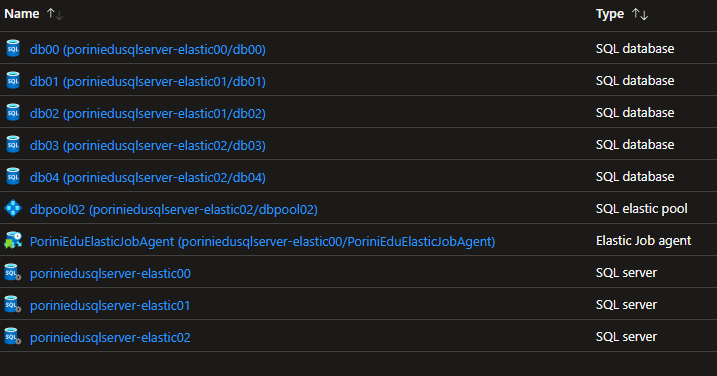

# Elastic Job


- [Elastic Job](#elastic-job)
  - [Link to resource](#link-to-resource)
  - [Creation Azure Resources of demo environment (with Powershell)](#creation-azure-resources-of-demo-environment-with-powershell)
  - [Creation SQL Logins of demo environment (with Powershell)](#creation-sql-logins-of-demo-environment-with-powershell)
  - [Demo (group of databases)](#demo-group-of-databases)
  - [Demo (Elastic Pool)](#demo-elastic-pool)
  - [Final Cleaning](#final-cleaning)


## Link to resource

 <https://www.sqlshack.com/elastic-jobs-in-azure-sql-database/>
 
 <https://docs.microsoft.com/en-us/azure/azure-sql/database/elastic-jobs-overview>
 
 <https://docs.microsoft.com/en-us/azure/azure-sql/database/elastic-jobs-tsql-create-manage>
 
 <https://docs.microsoft.com/en-us/sql/relational-databases/system-stored-procedures/sp-add-jobstep-transact-sql>
 
 <https://docs.microsoft.com/en-us/azure/azure-sql/database/elastic-jobs-powershell-create>

## Creation Azure Resources of demo environment (with Powershell)

Module used:

- Az.Sql
- Az.Resources

<https://github.com/Huachao/azure-content/blob/master/articles/sql-database/sql-database-elastic-jobs-powershell.md>

Creation of 3 Logical Servers and 5 Sql Azure Databases

- poriniedusqlserver-elastic00 ==> 1 database (DB00) Master shards
- poriniedusqlserver-elastic01 ==> 2 databases (DB01,DB02) Both in the job group
- poriniedusqlserver-elastic02 ==> 1 databases (DB03,DB04) Only DB03 in the job group

Users:

- **MasterUser** Password: *MasterUniform01!*  ==> user who runs the jobs
- **JobUser** Password: *JulietUniform01!* ==> user that connects to the master databases

 ``` Powershell
# *** Creation of demo environment for Elastic Job

# parameters 
$tenantid = 'f94c319b-4158-443e-a71f-ebab86508687'
$subscriptionId = '2456bd8c-7ce3-4a81-9a96-847fe17f01f2'
$resourceGroupTarget ='PoriniSqlEdu02'
$location = "NorthEurope"

$sqlAdminLogin = 'Student00';
$sqlAdminPassword ='SierraTango19$$';
$startIp = "0.0.0.0";
$endIp = "255.255.255.255";

$virtualServer1 = 'poriniedusqlserver-elastic00';
$virtualServer2 = 'poriniedusqlserver-elastic01';
$virtualServer3 = 'poriniedusqlserver-elastic02';


# utility functions

#Check resource existence
Function Get-OKGoOn
    { 
      [cmdletbinding()]
      Param(
        [parameter(Mandatory=$true)] [string] $tipoRisorsa,
        [parameter(Mandatory=$true)] [string] $nomeRisorsa
      )

    $domanda = "{0} {1} già esistente. Proseguo ? (yes,no)"  -f $tipoRisorsa, $nomeRisorsa
    $scelta = Read-Host $domanda
    if ($scelta -ne 'yes') {return 'NO'}
    if ($scelta -eq 'yes') {return 'YES'}

}

#Creation of the Logical Servers
Function New-VirtualServer 
{ 
  [cmdletbinding()]
  Param(
    [parameter(Mandatory=$true)] [string] $virtualServerName,
    [parameter(Mandatory=$true)] [string] $resourceGroup,
    [parameter(Mandatory=$true)] [string] $login,
    [parameter(Mandatory=$true)] [string] $password,
    [parameter(Mandatory=$true)] [string] $startIp,
    [parameter(Mandatory=$true)] [string] $endIP,
    [parameter(Mandatory=$true)] [string] $location

  )

    $Esiste = 0;
    $servers = Get-AzSqlServer
    foreach ($a in $servers)
        {
            if ($a.ServerName -eq $virtualServerName) {$Esiste = 1}
        }

    if($Esiste -eq 0) {

                [securestring]$secStringPassword = ConvertTo-SecureString $password -AsPlainText -Force
                [pscredential]$cred = New-Object System.Management.Automation.PSCredential ($login,$secStringPassword)


               $Parameters = @{
                    ResourceGroupName = $resourceGroup
                    Location = $location     
                    ServerName = $virtualServerName
                    SqlAdministratorCredentials = $cred
                }

              $server = New-AzSqlServer @Parameters

              #Apertura Firewall sull'intervallo IP address
                $Parameters = @{
                    ResourceGroupName = $resourceGroup   
                    ServerName = $virtualServerName
                    FirewallRuleName = "AllowedIPs"
                    StartIpAddress = $startIp
                    EndIpAddress = $endIp

                }

            $serverfirewallrule = New-AzSqlServerFirewallRule @Parameters

            Write-Host "Virtual server $virtualServerName Creato" -ForegroundColor Green

    }

    return $Esiste
}

# Creation of the Azure Sql Databases
Function New-AzureDB 
{ 
  [cmdletbinding()]
  Param(
    [parameter(Mandatory=$true)] [string] $logicalServerName,
    [parameter(Mandatory=$true)] [string] $resourceGroup,
    [parameter(Mandatory=$true)] [string] $dataBaseName,
    [parameter(Mandatory=$true)] [string] $serviceLevel

  )
    $Esiste = 0;
    $dbs = Get-AzSqlDatabase -ResourceGroupName $resourceGroup -ServerName $logicalServerName

    foreach ($a in $dbs)
        {
            if ($a.DatabaseName -eq $dataBaseName) {$Esiste= 1}
        }

    if($Esiste -eq 0) {


            $Parameters = @{
                ResourceGroupName = $resourceGroup   
                ServerName = $logicalServerName
                Edition = 'Standard'
                DatabaseName = $dataBaseName
                RequestedServiceObjectiveName = $serviceLevel
                SampleName =  "AdventureWorksLT"
                LicenseType = "LicenseIncluded"
            }

        $database = New-AzSqlDatabase @Parameters

        Write-Host "Database $dataBaseName Creato" -ForegroundColor Green
    }

    return $Esiste
}

# Connection to Azure (SubscriptionId is necessary if you have multiple subscriptions in your tenants)
Connect-AzAccount -Tenant xxxxx -SubscriptionId xxxxx 


# Creation of the Resource Groups

    #Valorizzo il flag se esiste il resource group
    $Flag = 0;

    $Risorse = Get-AzResourceGroup
    foreach ($a in $Risorse)
    {
        if ($a.ResourceGroupName -eq $ResourceGroupTarget) {$Flag= 1}
    }

    if($Flag -eq 0) 
        {
            New-AzResourceGroup -Name $resourceGroupTarget -Location $location
            Write-Host "Resource group $resourceGroupTarget Creato" -ForegroundColor Green
        };

    if($Flag -ne 0) 
    {
        $scelta = Read-Host "Resource group  $resourceGroupTarget già esistente. Proseguo ? (yes,no)"
        if ($scelta -ne 'yes') {return}
    }


# Creation of the Logical Servers

$Parameters = @{
    resourceGroup = $resourceGroupTarget
    location = $location     
    login = $sqlAdminLogin
    password = $sqlAdminPassword
    startIp = $startIp
    endIp = $endIp

}

$esiste = New-VirtualServer  -virtualServerName $virtualServer1   @Parameters
if ($esiste -eq 1)  {$scelta = Get-OKGoOn -tipoRisorsa "Virtual server" -nomeRisorsa $virtualServer1;  if ($scelta -ne 'yes') {return}}  


$esiste = New-VirtualServer  -virtualServerName $virtualServer2  @Parameters
if ($esiste -eq 1)  {$scelta = Get-OKGoOn -tipoRisorsa "Virtual server" -nomeRisorsa $virtualServer2;  if ($scelta -ne 'yes') {return}}  


$esiste = New-VirtualServer  -virtualServerName $virtualServer3   @Parameters
if ($esiste -eq 1)  {$scelta = Get-OKGoOn -tipoRisorsa "Virtual server" -nomeRisorsa $virtualServer3;  if ($scelta -ne 'yes') {return}}  


#Creation of the Databases

$esiste = New-AzureDB -logicalServerName $virtualServer1 -dataBaseName 'db00' -serviceLevel 'S0' $resourceGroupTarget
if ($esiste -eq 1)  {$scelta = Get-OKGoOn -tipoRisorsa "Database " -nomeRisorsa 'db00';  if ($scelta -ne 'yes') {return}}  

$esiste = New-AzureDB -logicalServerName $virtualServer2 -dataBaseName 'db01' -serviceLevel 'S0' $resourceGroupTarget
if ($esiste -eq 1)  {$scelta = Get-OKGoOn -tipoRisorsa "Database " -nomeRisorsa 'db01';  if ($scelta -ne 'yes') {return}}  

$esiste = New-AzureDB -logicalServerName $virtualServer2 -dataBaseName 'db02' -serviceLevel 'S0' $resourceGroupTarget
if ($esiste -eq 1)  {$scelta = Get-OKGoOn -tipoRisorsa "Database " -nomeRisorsa 'db02';  if ($scelta -ne 'yes') {return}}  


$esiste = New-AzureDB -logicalServerName $virtualServer3 -dataBaseName 'db03' -serviceLevel 'S0' $resourceGroupTarget
if ($esiste -eq 1)  {$scelta = Get-OKGoOn -tipoRisorsa "Database " -nomeRisorsa 'db03';  if ($scelta -ne 'yes') {return}}  

$esiste = New-AzureDB -logicalServerName $virtualServer3 -dataBaseName 'db04' -serviceLevel 'S0' $resourceGroupTarget
if ($esiste -eq 1)  {$scelta = Get-OKGoOn -tipoRisorsa "Database " -nomeRisorsa 'db04';  if ($scelta -ne 'yes') {return}}  


# Creation of the Elastic Job Agent
$jobDatabase= Get-AzSqlDatabase -DatabaseName 'db00' -ServerName $virtualServer1 -ResourceGroupName $resourceGroupTarget 

$jobAgent = $jobDatabase | New-AzSqlElasticJobAgent -Name 'PoriniEduElasticJobAgent'


# Creation of the Elastic Pool
    $Parameters = @{
                ResourceGroupName = $resourceGroupTarget   
                ServerName = $virtualServer3
                Edition = 'Standard'
                Dtu = 200 
                DatabaseDtuMin = 10 
                DatabaseDtuMax = 200
            }


    New-AzSqlElasticPool @Parameters  -ElasticPoolName dbpool02

```

Resources created



## Creation SQL Logins of demo environment (with Powershell)

``` Powershell
# Creation
# User Database Credentials
$MasterUserLogin = 'MasterUser';
$MasterUserPassword ='MasterUniform01!';

$JobUserLogin = 'JobUser'
$JobUserPassword ='JulietUniform01!';

$Server01 = $virtualServer1 + ".database.windows.net"
$Server02 = $virtualServer2 + ".database.windows.net"
$Server03 = $virtualServer3 + ".database.windows.net"


# Creation Login and user on all Databases

$q_createMasterLogin = " CREATE LOGIN {0} WITH PASSWORD = '{1}' "  -f $MasterUserLogin, $MasterUserPassword
$q_createMasterUser = " CREATE USER $MasterUserLogin FROM LOGIN $MasterUserLogin; "

$q_createJobLogin = " CREATE LOGIN {0} WITH PASSWORD = '{1}' "  -f $JobUserLogin, $JobUserPassword
$q_createJobUser = " CREATE USER $JobUserLogin FROM LOGIN $JobUserLogin; "

$q_addrolemember = " EXEC sp_addrolemember N'db_owner', N'{0}' " -f $JobUserLogin


# Server 1 - Master
Invoke-Sqlcmd -Query $q_createMasterLogin -ServerInstance $Server01 -Database "master" -Username $sqlAdminLogin -Password $sqlAdminPassword
Invoke-Sqlcmd -Query $q_createJobLogin -ServerInstance $Server01 -Database "master" -Username $sqlAdminLogin -Password $sqlAdminPassword
Invoke-Sqlcmd -Query $q_createMasterUser -ServerInstance $Server01 -Database "master" -Username $sqlAdminLogin -Password $sqlAdminPassword
Invoke-Sqlcmd -Query $q_createJobUser -ServerInstance $Server01 -Database "master" -Username $sqlAdminLogin -Password $sqlAdminPassword

Write-Host ' Server1 - Master Logins created' -ForegroundColor Green

# Server 1 - db00
Invoke-Sqlcmd -Query $q_createMasterUser -ServerInstance $Server01 -Database "db00" -Username $sqlAdminLogin -Password $sqlAdminPassword
Invoke-Sqlcmd -Query $q_createJobUser -ServerInstance $Server01 -Database "db00" -Username $sqlAdminLogin -Password $sqlAdminPassword
Invoke-Sqlcmd -Query $q_addrolemember -ServerInstance $Server01 -Database "db00" -Username $sqlAdminLogin -Password $sqlAdminPassword

Write-Host ' Server1 - DB00 Logins created' -ForegroundColor Green


# Server 2 - Master
Invoke-Sqlcmd -Query $q_createMasterLogin -ServerInstance $Server02 -Database "master" -Username $sqlAdminLogin -Password $sqlAdminPassword
Invoke-Sqlcmd -Query $q_createJobLogin -ServerInstance $Server02 -Database "master" -Username $sqlAdminLogin -Password $sqlAdminPassword
Invoke-Sqlcmd -Query $q_createMasterUser -ServerInstance $Server02 -Database "master" -Username $sqlAdminLogin -Password $sqlAdminPassword
Invoke-Sqlcmd -Query $q_createJobUser -ServerInstance $Server02 -Database "master" -Username $sqlAdminLogin -Password $sqlAdminPassword

Write-Host ' Server2 - Master Logins created' -ForegroundColor Green

# Server 2 - db01
Invoke-Sqlcmd -Query $q_createMasterUser -ServerInstance $Server02 -Database "db01" -Username $sqlAdminLogin -Password $sqlAdminPassword
Invoke-Sqlcmd -Query $q_createJobUser -ServerInstance $Server02 -Database "db01" -Username $sqlAdminLogin -Password $sqlAdminPassword
Invoke-Sqlcmd -Query $q_addrolemember -ServerInstance $Server02 -Database "db01" -Username $sqlAdminLogin -Password $sqlAdminPassword

Write-Host ' Server2 - DB01 Logins created' -ForegroundColor Green


# Server 2 - db02
Invoke-Sqlcmd -Query $q_createMasterUser -ServerInstance $Server02 -Database "db02" -Username $sqlAdminLogin -Password $sqlAdminPassword
Invoke-Sqlcmd -Query $q_createJobUser -ServerInstance $Server02 -Database "db02" -Username $sqlAdminLogin -Password $sqlAdminPassword
Invoke-Sqlcmd -Query $q_addrolemember -ServerInstance $Server02 -Database "db02" -Username $sqlAdminLogin -Password $sqlAdminPassword

Write-Host ' Server2 - DB02 Logins created' -ForegroundColor Green

# Server 3 - master
Invoke-Sqlcmd -Query $q_createMasterLogin -ServerInstance $Server03 -Database "master" -Username $sqlAdminLogin -Password $sqlAdminPassword
Invoke-Sqlcmd -Query $q_createJobLogin -ServerInstance $Server03 -Database "master" -Username $sqlAdminLogin -Password $sqlAdminPassword
Invoke-Sqlcmd -Query $q_createMasterUser -ServerInstance $Server03 -Database "master" -Username $sqlAdminLogin -Password $sqlAdminPassword
Invoke-Sqlcmd -Query $q_createJobUser -ServerInstance $Server03 -Database "master" -Username $sqlAdminLogin -Password $sqlAdminPassword

Write-Host ' Server3 - Master Logins created' -ForegroundColor Green


# Server 3 - db03
Invoke-Sqlcmd -Query $q_createMasterUser -ServerInstance $Server03 -Database "db03" -Username $sqlAdminLogin -Password $sqlAdminPassword
Invoke-Sqlcmd -Query $q_createJobUser -ServerInstance $Server03 -Database "db03" -Username $sqlAdminLogin -Password $sqlAdminPassword
Invoke-Sqlcmd -Query $q_addrolemember -ServerInstance $Server03 -Database "db03" -Username $sqlAdminLogin -Password $sqlAdminPassword

Write-Host ' Server3 - DB03 Logins created' -ForegroundColor Green

# Server 3 - db04
Invoke-Sqlcmd -Query $q_createMasterUser -ServerInstance $Server03 -Database "db04" -Username $sqlAdminLogin -Password $sqlAdminPassword
Invoke-Sqlcmd -Query $q_createJobUser -ServerInstance $Server03 -Database "db04" -Username $sqlAdminLogin -Password $sqlAdminPassword
Invoke-Sqlcmd -Query $q_addrolemember -ServerInstance $Server03 -Database "db04" -Username $sqlAdminLogin -Password $sqlAdminPassword

Write-Host ' Server3 - DB04 Logins created' -ForegroundColor Green
 ```

## Demo (group of databases)

 ``` SQL
-- Connection to Master Shards: Server0 - DB00
-- poriniedusqlserver-elastic00 DB00 

CREATE MASTER KEY ENCRYPTION BY PASSWORD='SierraTango19$$';  
 
 -- DB00 (master shards) credential with which the jobs in the group databases will be executed
CREATE DATABASE SCOPED CREDENTIAL JobExecution 
WITH IDENTITY = 'JobUser',
SECRET = 'JulietUniform01!';  
GO

 -- DB00 (master shards) credential with which to access the master databases to enumerate the databases
CREATE DATABASE SCOPED CREDENTIAL MasterUser 
WITH IDENTITY = 'MasterUser',
SECRET ='MasterUniform01!';
GO


-- DB00 creation of the Job group
EXEC jobs.sp_add_target_group 'ShardDatabase'

-- DB00 add to the Job Group all databases of server1
EXEC jobs.sp_add_target_group_member 
    N'ShardDatabase',
    @target_type = N'SqlServer',
    @refresh_credential_name = 'MasterUser',
    @server_name ='poriniedusqlserver-elastic01.database.windows.net'
    ;

--add to the Job Group all databases of server2
EXEC jobs.sp_add_target_group_member 
    N'ShardDatabase',
    @target_type = N'SqlServer',
    @refresh_credential_name = 'MasterUser',
    @server_name ='poriniedusqlserver-elastic02.database.windows.net'
; 

-- remove db04 from the group
EXEC jobs.sp_add_target_group_member 
    N'ShardDatabase',
    @target_type = N'SqlDatabase',
    @membership_type = N'Exclude',
    @server_name ='poriniedusqlserver-elastic02.database.windows.net',
    @database_name = N'db04'
;

-- check
SELECT * FROM jobs.target_groups;
GO

SELECT target_group_name, 
        membership_type,
        refresh_credential_name,
        server_name,
        database_name
FROM jobs.target_group_members;
GO


-- creation of the JOB
EXEC jobs.sp_add_job @job_name ='ElasticJob01', 
    @description ='Test Elastic Job';
GO

EXEC jobs.sp_add_jobstep @job_name = 'ElasticJob01',
@command = 
    'IF NOT EXISTS (SELECT name FROM sys.tables WHERE name =''ElasticJob'')
    CREATE TABLE dbo.ElasticJob
    (ID INT IDENTITY,
    CurrentDateTime DateTime,
    Description VARCHAR(50)
    )',
 @credential_name = 'JobExecution',
 @target_group_name= 'ShardDatabase';

-- Check
SELECT job_name,
    job_version,
    description,enabled,
    schedule_interval_type,
    schedule_interval_count 
    FROM jobs.jobs
 
SELECT * FROM jobs.job_versions
 
SELECT job_name,
    step_name,
    command_type,
    command 
FROM jobs.jobsteps

-- execution
EXEC jobs.sp_start_job 'ElasticJob01'

-- monitoring
SELECT job_name,
    start_time,
    last_message, 
    target_server_name,
    target_database_name 
FROM 
    jobs.job_executions
order by start_time desc
;


--- Add a new step
EXEC jobs.sp_add_jobstep @job_name = 'ElasticJob01',
@command = 
'INSERT INTO dbo.ElasticJob
(CurrentDateTime,Description)
VALUES
(GETDATE(),''Schedule Record'')',
@step_name = 'Step 2',
@credential_name = 'JobExecution',
@target_group_name = 'ShardDatabase'
;
GO

-- execute
EXEC jobs.sp_start_job 'ElasticJob01'

-- scheduling every minute
EXEC jobs.sp_update_job @job_name = 'ElasticJob01',
@enabled = 1, 
@schedule_interval_type ='minutes',
@schedule_interval_count = 1

-- monitoring
SELECT job_name,
    start_time,
    last_message, 
    target_server_name,
    target_database_name 
FROM 
    jobs.job_executions
order by start_time desc
;

-- disabling job
EXEC jobs.sp_update_job @job_name = 'ElasticJob01',
@enabled = 0
;
```

## Demo (Elastic Pool)

``` SQL

-- Target Group ON Elastic Pool

-- PREREQUISITE: Create Elastic Pool dbpool02

-- Adding DB03 and DB04 to Elastic Pool dbpool02

 -- ************* Execute on master of Server 3 poriniedusqlserver-elastic02  
 ALTER DATABASE db03
 MODIFY ( SERVICE_OBJECTIVE = ELASTIC_POOL ( name = dbpool02)) ; 

 ALTER DATABASE db04
 MODIFY ( SERVICE_OBJECTIVE = ELASTIC_POOL ( name = dbpool02)) ; 


-- ************* Execute on Master Shards: Server0 - DB00

-- creation of the Job group
EXEC jobs.sp_add_target_group 'PoolGroup02'

-- adding databases
EXEC jobs.sp_add_target_group_member 
    @target_group_name = 'PoolGroup02',
    @target_type = 'SqlElasticPool',
    @refresh_credential_name = 'MasterUser',
    @server_name ='poriniedusqlserver-elastic02.database.windows.net',
    @elastic_pool_name = 'dbpool02'
    ;
GO
-- creaation of the Job
EXEC jobs.sp_add_job @job_name ='ElasticJob02', 
    @description ='Test Elastic Job Pool'

EXEC jobs.sp_add_jobstep @job_name = 'ElasticJob02',
@command = 
'IF NOT EXISTS (SELECT name FROM sys.tables WHERE name =''ElasticJob2'')
CREATE TABLE ElasticJob2
(ID INT IDENTITY,
CurrentDateTime DateTime,
Description VARCHAR(50)
)',
 @credential_name = 'JobExecution',
 @target_group_name= 'PoolGroup02';
 GO
 --- Aggiungo step
EXEC jobs.sp_add_jobstep @job_name = 'ElasticJob02',
@command = 
'INSERT INTO ElasticJob2
(CurrentDateTime,Description)
VALUES
(GETDATE(),''Pool'')',
@step_name = 'Step 2',
@credential_name = 'JobExecution',
@target_group_name = 'PoolGroup02'
;
GO

 -- job execution
EXEC jobs.sp_start_job 'ElasticJob02'

-- monitoring
SELECT job_name,
        start_time,
        last_message, 
        target_server_name,
        target_database_name 
FROM 
        jobs.job_executions
order by start_time desc
;

-- check
SELECT * FROM jobs.jobsteps;

```


## Final Cleaning

  ``` SQL

-- Deleting Jobs
EXEC jobs.sp_delete_job @job_name='ElasticJob01';
EXEC jobs.sp_delete_job @job_name='ElasticJob02', @force = 1;

-- Deleting Groups
exec jobs.sp_delete_target_group  @target_group_name = 'ShardDatabase'
exec jobs.sp_delete_target_group  @target_group_name = 'PoolGroup02'
 
 ```

 ``` Powershell
 # Deleting resources
    Remove-AzResourceGroup -Name $resourceGroupTarget -Force
 ```
