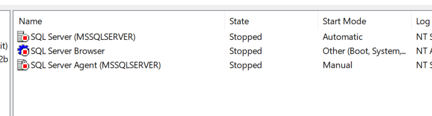
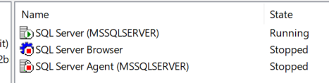
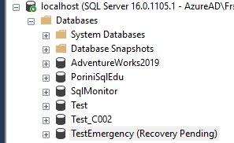
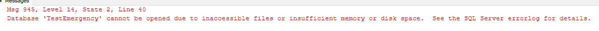

# Emergency Mode Example

<https://www.sqlskills.com/blogs/paul/checkdb-from-every-angle-emergency-mode-repair-the-very-very-last-resort/>

Sometimes for several not-lucky situations a database goes into suspected mode or recovery pending

In this case, to fix it, you have to put the database in emergency mode and, after some activities, like CHECKDB, recover the database.

Here a didattical example of utilization of EMERGENCY MODE

Emergency mode is a status introduced for SQL Server to process damaged databases, especially those in suspect mode. The Emergency mode is used when the SQL Server database is in suspect mode and we switch to emergency mode to read the data.

## Setup

``` SQL
USE [master]
GO

CREATE DATABASE [TestEmergency]
 CONTAINMENT = NONE
 ON  PRIMARY 
( NAME = N'TestEmergency', FILENAME = N'C:\Temp\TestEmergency.mdf' , SIZE = 128MB , MAXSIZE = 256MB , FILEGROWTH = 64MB )

 LOG ON 
( NAME = N'TestEmergency_log', FILENAME = N'C:\Temp\TestEmergency_log.ldf' , SIZE = 128MB , MAXSIZE = 256MB , FILEGROWTH = 32MB )
GO

use TestEmergency
GO

create table dbo.T01
(id int, Codice varchar(20));
GO

insert into dbo.T01
values (1,'alfa'),(2,'bravo'),(3,'Charlie');
GO
```

## Generate the problem (*delete transaction log file*)

``` SQL
-- a uncommited transaction
BEGIN TRAN;
    UPDATE dbo.T01
    SET codice = 'delta'
    where id = 1;
```

``` SQL
--run in different session to write on disk the uncommited transaction
USE EmergencyAdv
GO
CHECKPOINT;
GO
```

### STOPPING SQL Server Services



### Deleting Transaction Log File

DEL C:\Temp\TestEmergency_log.ldf

### RESTARTING SQL Server Services



## Check Database

The database is in recovery pending status



``` SQL
SELECT 	name, state_desc 
    FROM sys.databases
    WHERE name = 'TestEmergency';
```


And it is inacessible

``` SQL
select * from dbo.T01
```



## Fix the problem with Emergency State

``` SQL
ALTER DATABASE TestEmergency SET EMERGENCY;

SELECT 	name, state_desc 
    FROM sys.databases
    WHERE name = 'TestEmergency';
```


The database can now be accessed for reading

``` SQL
use TestEmergency
GO

-- note that the values present were not committed 
select * from dbo.T01

```


And could be fixed with DBCC CHECKDB

``` SQL

-- DBCC CHECKDB required SINGLE USER MODE
ALTER DATABASE TestEmergency
SET SINGLE_USER WITH ROLLBACK IMMEDIATE;

DBCC CHECKDB('TestEmergency', REPAIR_ALLOW_DATA_LOSS) WITH ALL_ERRORMSGS, NO_INFOMSGS;
```

The Tlog is rebuilt. This is the message:

*File activation failure. The physical file name "C:\Temp\TestEmergency_log.ldf" may be incorrect.
The log cannot be rebuilt because there were open transactions/users when the database was shutdown, no checkpoint occurred to the database, or the database was read-only. This error could occur if the transaction log file was manually deleted or lost due to a hardware or environment failure.
Failed to restart the current database. The current database is switched to master.
Warning: The log for database 'TestEmergency' has been rebuilt. Transactional consistency has been lost. The RESTORE chain was broken, and the server no longer has context on the previous log files, so you will need to know what they were. You should run DBCC CHECKDB to validate physical consistency. The database has been put in dbo-only mode. When you are ready to make the database available for use, you will need to reset database options and delete any extra log files.*

and the database is On Line but in Single User Mode


``` SQL
-- SET Multiuser again
ALTER DATABASE TestEmergency SET MULTI_USER;
```

## clean up

``` SQL
use Master 
GO
Drop database TestEmergency
GO
```
