# Change Tracking

[Microsoft Documentation](https://learn.microsoft.com/en-us/sql/relational-databases/track-changes/about-change-tracking-sql-server)

- [Change Tracking](#change-tracking)
  - [Set Example Data](#set-example-data)
  - [Activation and Setting Change Tracking](#activation-and-setting-change-tracking)
  - [Testing Change Tracking](#testing-change-tracking)
  - [Change Tracking Functions](#change-tracking-functions)
    - [CHANGETABLE()](#changetable)
    - [CHANGE\_TRACKING\_CURRENT\_VERSION()](#change_tracking_current_version)
    - [CHANGE\_TRACKING\_MIN\_VALID\_VERSION()](#change_tracking_min_valid_version)
    - [CHANGE\_TRACKING\_IS\_COLUMN\_IN\_MASK()](#change_tracking_is_column_in_mask)
  - [DMV'S correlated to Change Tracking](#dmvs-correlated-to-change-tracking)
  - [Internal Table](#internal-table)
  - [Truncate](#truncate)
  - [Check if the value of a column has been changed](#check-if-the-value-of-a-column-has-been-changed)
  - [Disable CHANGE TRACKING](#disable-change-tracking)
  - [Auto cleaning](#auto-cleaning)
  - [ETL Processing](#etl-processing)

Change Tracking is a feature that permits the identification of all the rows of a table that are changed (inserted, updated, or deleted).

Every time a modification has been committed, a counter is incremented, and the keys of all modified rows (the table must have a primary key) are written in a system table.

The data in this system table can be read with functions dedicated.

Change Tracking does not store the intermediate variations of a row nor does it provide information on how many times it "evolves" over time: for each record it only records the information relating to its last change, overwriting it every time a new DML operation is performed

If it is necessary to recover the historical values and all the changes that have occurred to the data, the [Temporal Table](c:/Github/Code_Tips-and-Examples/TSQL/Examples/Query/TemporalTable.md) or the [Change Data Capture](
https://learn.microsoft.com/en-us/sql/relational-databases/track-changes/about-change-data-capture-sql-server)  must be used.

By not storing the individual modified values, the activity has a very low overhead.

The information in the System Table is retained for a time defined during the setting of Change Tracking (Days, Hours or Minutes).

## Set Example Data

``` SQL

Use Master
GO

CREATE DATABASE TestChangeTracking;
GO

Use TestChangeTracking
GO

CREATE TABLE dbo.CT1(
    id int primary key NOT NULL,
    codice varchar(20) NULL,
    Valore numeric (8,2) NULL
    );
GO

CREATE TABLE dbo.CT2(
    id int primary key NOT NULL,
    codice varchar(20) NULL,
    Valore numeric (8,2) NULL
    );
GO
```

## Activation and Setting Change Tracking

``` SQL
-- Enable Change Tracking at the Database Level (Mandatory)

ALTER DATABASE TestChangeTracking  
SET CHANGE_TRACKING = ON 
(CHANGE_RETENTION = 20 MINUTES, AUTO_CLEANUP = ON);

--(CHANGE_RETENTION = 1 HOURS, AUTO_CLEANUP = ON);
--(CHANGE_RETENTION = 2 DAYS, AUTO_CLEANUP = ON)
GO

-- Enable Change Tracking at the Table Level

ALTER TABLE dbo.CT1
ENABLE CHANGE_TRACKING
WITH (TRACK_COLUMNS_UPDATED = ON);  -- store information about which columns were updated
GO

ALTER TABLE dbo.CT2
ENABLE CHANGE_TRACKING;  -- Default NO TRACK_COLUMNS_UPDATED 
GO
```

## Testing Change Tracking

``` SQL
insert into dbo.CT1
values
(1,'alfa',23.2),(2,'Bravo',34.7),(3, 'Charlie',null);
GO

insert into dbo.CT2
values
(100,'Golf',1000),(200,'Fox',2000);
GO

select * from CHANGETABLE(CHANGES dbo.CT1, 0) AS CT
order by Sys_Change_version;

select * from CHANGETABLE(CHANGES dbo.CT2, 0) AS CT;
```

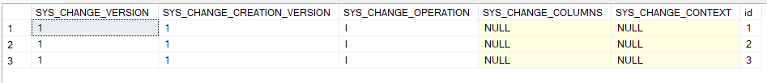

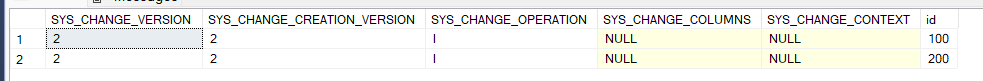

``` SQL
insert into dbo.CT1
values (4,'Delta', 1.24);

Update dbo.CT1
set Codice = 'Zulu'
where id =1;

select * from CHANGETABLE(CHANGES dbo.CT1, 0) AS CT
order by Sys_Change_version;
```

The row id=1 was created at the 1° commit but updated at 4° one
*sys_change_version= 4, sys_change_creation_version=1*

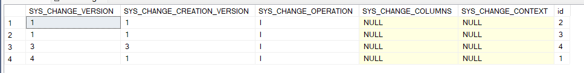

``` SQL
-- update and insert in the same transaction
BEGIN TRAN
    insert into dbo.CT1
    values (5,'Echo', 88);

    Update dbo.CT1
    set Codice = 'Yankee'
    where id =2;
COMMIT

select * from CHANGETABLE(CHANGES dbo.CT1, 0) AS CT
order by Sys_Change_version;
```

Rows id=2 and Id= 5 have the same sys_change_version

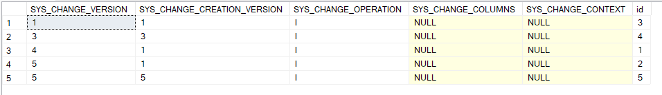

The second parameter of CHANGETABLE function permits to get only the rows modified after that commit.

``` SQL
select * from CHANGETABLE(CHANGES dbo.CT1, 0) AS CT
order by Sys_Change_version;

select * from CHANGETABLE(CHANGES dbo.CT1, 3) AS CT
order by Sys_Change_version;
```

SYS_CHANGE_OPERATION shows the type of modification operations (Insert, Update, Delete)

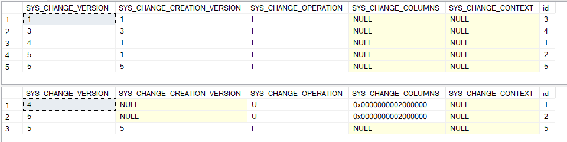

It is possible to join the CHANGETABLE function with the data table to get data after a certain commit. In this example after the 2° commit

``` SQL
SELECT 
    CT.SYS_CHANGE_VERSION, 
    CT.SYS_CHANGE_CREATION_VERSION, 
    T.*
FROM 
    CHANGETABLE(CHANGES dbo.CT1, 2) AS CT
INNER JOIN 
    dbo.CT1 AS T ON T.Id = CT.id
;
```

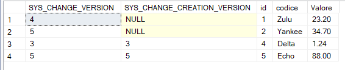

outer join from CHANGETABLE() and data table are useful to get deleted rows

``` SQL
delete from dbo.CT1
where id=4;
GO

SELECT 
    CT.SYS_CHANGE_VERSION, 
    CT.SYS_CHANGE_CREATION_VERSION, 
    CT.SYS_CHANGE_OPERATION,
    CT.id,
    T.*
FROM 
    CHANGETABLE(CHANGES dbo.CT1, 2) AS CT  -- on
LEFT OUTER JOIN 
    dbo.CT1 AS T ON T.Id = CT.id
ORDER BY CT.SYS_CHANGE_VERSION;
;
```

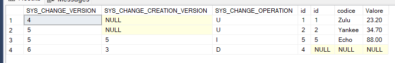

CHANGETABLE() could also be used with the *VERSION* option. In that case, it returns for all rows the number of the last modified version

``` SQL
SELECT 
    a.*,
    ct.SYS_CHANGE_VERSION
FROM 
    dbo.CT1 a
    CROSS APPLY 
    CHANGETABLE(VERSION dbo.CT1,(id),(a.id)) AS CT
;
```

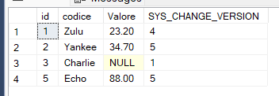

## Change Tracking Functions

### CHANGETABLE()

Returns tracking information for all changes to a table that have occurred since a specified version-

### CHANGE_TRACKING_CURRENT_VERSION()

Obtains a version that is associated with the last committed transaction. You can use this version the next time you enumerate changes by using CHANGETABLE.

### CHANGE_TRACKING_MIN_VALID_VERSION()

Returns the minimum version that is valid for use in obtaining change tracking information from the specified table when you are using the CHANGETABLE function. If AUTO CLEANUP is ON and the log records has been deleted

### CHANGE_TRACKING_IS_COLUMN_IN_MASK()

Interprets the SYS_CHANGE_COLUMNS value that is returned by the CHANGETABLE(CHANGES ...) function. [see here](#check-if-the-value-of-a-column-has-been-changed)

## DMV'S correlated to Change Tracking

Check if Change Tracking is Enabled

``` SQL
-- Returns one row for each database that has change tracking enabled.

select 
    db_name (a.database_id) as DataBaseName,*
from sys.change_tracking_databases a


-- Returns one row for each table in the current database that has change tracking enabled.

select 
    OBJECT_NAME(object_id) as TableName,
    * 
from sys.change_tracking_tables
```

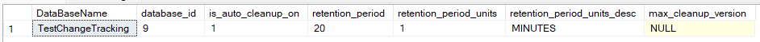

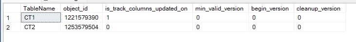

## Internal Table

For each table under Change Tracking is created an internal table (change_tracking_*TableID*) which contains all information about the modifieds

``` SQL
select * from sys.internal_tables
where internal_type_desc ='CHANGE_TRACKING'

-- Remember: The internal table could be read only from a DAC connection.
select * from sys.change_tracking_1221579390
```

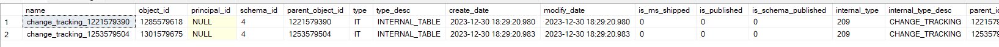

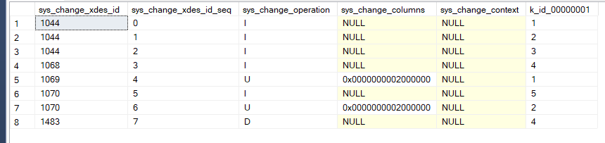

``` SQL
-- Displays one row for each transaction that is committed for a table that is tracked by SQL Server change tracking.
select * from sys.dm_tran_commit_table
```

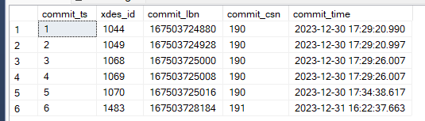

## Truncate

Truncate Table reset all change tracking data, but the SYS_CHANGE_VERSION maintains the value.

``` SQL
truncate table dbo.CT1;
GO

select * 
FROM CHANGETABLE(CHANGES dbo.CT1, 0) AS CT

insert into dbo.CT1
values
(1,'alfa',23.2),(2,'Bravo',34.7),(3, 'Charlie',null);
GO

update dbo.ct1
set Codice= 'Papa' 
where id=1;
GO

update dbo.ct1
set Codice= 'Hotel', Valore =99.99
where id=3;
GO

select * 
    FROM CHANGETABLE(CHANGES dbo.CT1, 0) AS CT
    order by SYS_CHANGE_VERSION;
GO
```

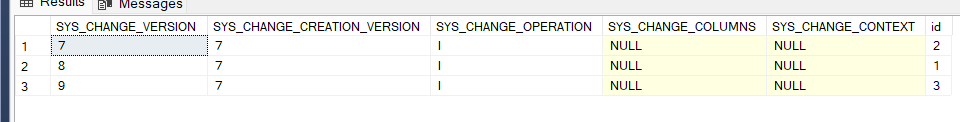

## Check if the value of a column has been changed

If ENABLE CHANGE_TRACKING is set to ON is possible, with CHANGE_TRACKING_IS_COLUMN_IN_MASK(), to check if a column has changed value.

``` SQL
drop table if Exists #t1
go

    SELECT SYS_CHANGE_VERSION,SYS_CHANGE_OPERATION,SYS_CHANGE_COLUMNS 
    into #t1
    FROM CHANGETABLE(CHANGES dbo.CT1, 7) AS CT

select 
    * ,
    CHANGE_TRACKING_IS_COLUMN_IN_MASK (COLUMNPROPERTY(OBJECT_ID('dbo.CT1'), 'Codice', 'ColumnId'),SYS_CHANGE_COLUMNS ) as Update_Codice,
    CHANGE_TRACKING_IS_COLUMN_IN_MASK (COLUMNPROPERTY(OBJECT_ID('dbo.CT1'), 'Valore', 'ColumnId'),SYS_CHANGE_COLUMNS ) as Update_Valore
from #t1
order by SYS_CHANGE_VERSION;
```

In the commit 8 Codice has been updated, while in commit 9 Codice and Valore has been updated.

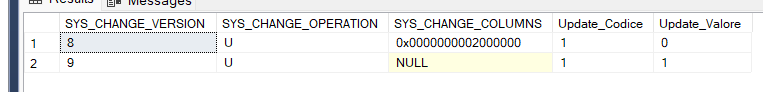

**REMARK**
Change Tracking is designed to support synchronization and ETL activities, for this reason the values of SYS_CHANGE_OPERATION and SYS_CHANGE_COLUMNS returned by CHANGETABLE() depend on the value of the last_sync_version parameter.

``` SQL
    SELECT SYS_CHANGE_VERSION,SYS_CHANGE_OPERATION,SYS_CHANGE_COLUMNS 
    FROM CHANGETABLE(CHANGES dbo.CT1, 0) AS CT

    SELECT SYS_CHANGE_VERSION,SYS_CHANGE_OPERATION,SYS_CHANGE_COLUMNS 
    FROM CHANGETABLE(CHANGES dbo.CT1, 7) AS CT
```

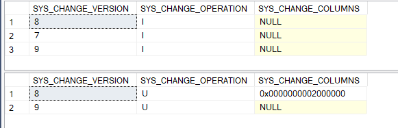

## Disable CHANGE TRACKING

``` SQL
--First you need to disable change tracking from the tables and then from the database

ALTER TABLE dbo.CT1 DISABLE CHANGE_TRACKING;
ALTER TABLE dbo.CT2 DISABLE CHANGE_TRACKING;
;
ALTER DATABASE TestChangeTracking SET CHANGE_TRACKING = OFF
```

If Change Tracking is deactivated and reactivated on the same database, the version will not restart from the value 0 but from the last one assigned before deactivation.

## Auto cleaning

If AUTO CLEANUP is set to ON after a time greater than the retain time, the records are deleted from the internal tables and not returned by the CHANGETABLE function. The claenig operation is managed automatically by SQL Server and it is not certain that it occurs exactly when the retain time expires

## ETL Processing

The steps for synchronizing  source and targe data in a ETL process are:

1) Retrieve the current version
2) Retrieve the last version extracted in the previous upload
3) Retrieve the minimum valid version of the table
4) Compare the minimum valid version extracted in point 3 with the current version extracted in point 2
5) Identify the rows modified starting from the version subsequent to the one extracted in point 2 and load them into a support table of the destination database
6) Compare the data loaded in the support table with that of the destination table and update them
7) Save the new version loaded
