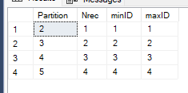
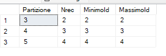
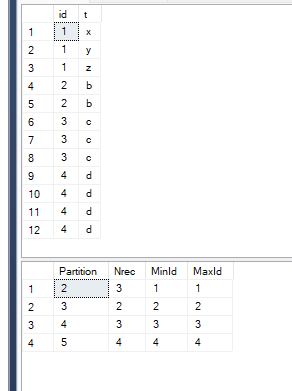
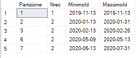

# Table Partition Example

<https://docs.microsoft.com/en-us/sql/relational-databases/partitions/create-partitioned-tables-and-indexes>

Remark:

- partitions can be applied on the same filegroup.
- partitions are extremely helpfull whenever you need to provide massive deletes.
- Having more filegroups provide higher level of tidiness

## Set up enviroment and setting partition

``` SQL
USE master
GO

IF EXISTS (select * from sys.databases where name = 'Test')
 DROP DATABASE TestPartition;
GO

CREATE DATABASE TestPartition;
GO

USE TestPartition
GO

/* Partitioning using an integer */

-- Create the partitioning function
CREATE PARTITION FUNCTION pf_T( int )
AS RANGE RIGHT
FOR VALUES (1, 2, 3, 4, 5, 6);
go


- describe the filegroups to be used

CREATE PARTITION SCHEME ps_T
AS PARTITION pf_T
 TO ( [PRIMARY],[PRIMARY],[PRIMARY],[PRIMARY],[PRIMARY],[PRIMARY],[PRIMARY]); - 6 + 1
GO

/*
Create the partitioned table declaring the partitioning schema and the attribute on which it should be applied.
*/

drop table if exists  dbo.PT
GO
create table dbo.PT (id int not null, t varchar(10)) on ps_T(id);
GO

-- create table dbo.PT_SwitchOUT (id int not null, t varchar(10));

-- Example of partitioning on the clustered index:
-- create clustered index ic_PT on dbo.PT (id) on ps_T (id);


-- insert some values
insert into dbo.PT values 
(1,'a'),
(2,'b'),(2,'b'),
(3,'c'),(3,'c'),(3,'c'),
(4,'d'),(4,'d'),(4,'d'),(4,'d')
;
GO

select * from dbo.PT;
GO
```

## Checking partitions and using the partition's functions

``` SQL
/*
The function $partition.xxxx(y) - where xxxx is the name of the partitioning function - returns
the number of the partition associated to the given input y.
Let's try the function:
*/
select $partition.pf_T(-10);    -- 1: -10 is lower than the LimInf of the partition (RANGE RIGHT)
select $partition.pf_T(0);      -- 1:as previously
select $partition.pf_T(1);      -- 2
select $partition.pf_T(2);      -- 3
select $partition.pf_T(6);      -- 7: the last partition starts from 6
select $partition.pf_T(70);     -- 7: all the values greater than 6 are in the last partition

-- The inserted values are in the partition defined from the partitioning function

-- Number of records in each partition
select 
    Partition = $partition.pf_T(id),
    Nrec = count(*),
    minID = Min(id),
    maxID = Max(id)
from dbo.PT
group by $partition.pf_T(id);

```



## Example of use of SWITCH IN / SWITCH ON

If you have to delete all records in a partition, using this feature is very useful because it doesn't fill up the LOG.

``` SQL
-- I create a new table with the same schema to save the partition that I'm removing
create table dbo.PT_Temp (id int not null, t varchar(10));

-- Cleaning opeartion: the partitioning change table
-- from dbo.PT to dbo.PT_Temp
alter table dbo.PT switch  partition 2 to dbo.PT_Temp

-- now PT_temp has the records and PT has the partition number 2 empty
select * from dbo.PT_Temp;
select * from dbo.PT;

-- the partition number 2 doesn't exist anymore
select 
    $partition.pf_T(id) as Partizione,
    count(*) as Nrec, 
    Min (id) as MinimoId, 
    Max(id) as MassimoId
from dbo.PT
group by $partition.pf_T(id);
```



``` SQL
-- data can be moved from a table on a partitioned table
-- Example: I edit records on pt_Temp and I moved them back in the partitioned table
truncate table dbo.PT_Temp;
GO
insert into dbo.PT_Temp values (1,'x'),(1,'y'),(1,'z');
GO

-- to add them I must create a constraint to ensure that the data are correct on the partition
alter table dbo.PT_Temp
ADD CONSTRAINT IdChk CHECK (id>=1 and id<2)

-- I move the records into the partitioned table
-- Instant activity
alter table dbo.PT_Temp switch  to dbo.PT partition 2

-- the new records are in the partitioned table
select * from dbo.PT;

select 
    $partition.pf_T(id) as [Partition],
    count(*) as Nrec, 
    Min (id) as MinId, 
    Max(id) as MaxId
from dbo.PT
group by $partition.pf_T(id)
;

```



## Modify number of partition

``` SQL

-- Add some partitions to host new records

-- We can use the SPLIT statement to add a new section
-- We have to modify both the schema and the partitioning function

-- before
select $partition.pf_T(5); -- partizione 6
select $partition.pf_T(6); -- partizione 7
select $partition.pf_T(7); -- partizione 7

-- which is the filegroup of the new partition that I'm going to create
alter partition scheme ps_T NEXT used [primary] 

-- I add the new partitioning value (range)
alter partition function pf_T() split range(7)  

-- now the new record 7 is in the new partition
select $partition.pf_T(5); -- partition 6
select $partition.pf_T(6); -- partition 7
select $partition.pf_T(7); -- partition 8
select $partition.pf_T(8); -- partition 8

-- with the MERGE statement we can group some partitions
-- before
select $partition.pf_T(0); -- partition 1
select $partition.pf_T(1); -- partition 2
select $partition.pf_T(2); -- partition 3
select $partition.pf_T(3); -- partition 4

-- remove a range
alter partition function pf_T() merge range(1) 

-- after
select $partition.pf_T(0); -- partition 1
select $partition.pf_T(1); -- partition 1
select $partition.pf_T(2); -- partition 2
select $partition.pf_T(3); -- partition 3


-- the MERGE operation is available also in internal partitions

-- before
select $partition.pf_T(1); -- partition 1
select $partition.pf_T(2); -- partition 2
select $partition.pf_T(3); -- partition 3
select $partition.pf_T(4); -- partition 4
select $partition.pf_T(5); -- partition 5
select $partition.pf_T(6); -- partition 6
select $partition.pf_T(7); -- partition 7

-- remove a range
alter partition function pf_T() merge range(4)

-- after
select $partition.pf_T(1); -- partition 1
select $partition.pf_T(2); -- partition 2
select $partition.pf_T(3); -- partition 3
select $partition.pf_T(4); -- partition 3 (before 4)
select $partition.pf_T(5); -- partition 4 (before 5)
select $partition.pf_T(6); -- partition 5 (before 6)
select $partition.pf_T(7); -- partition 6 (before 7)
```

## Truncate a partition and switch with no partition table

Because a not partitioned table has anyway always the first partition, which contains all records

``` SQL
-- Second way to delete records from a partition
select * from dbo.PT
truncate table dbo.PT with (partitions (2 ));
select * from dbo.PT

-- we can use the SWITCH statement to istantly move record between two not partitioned tables
create table dbo.Uno (label varchar(10));
create table dbo.Due (label varchar(10));

insert into dbo.uno values ('alfa'),('bravo'),('charlie');

select * from dbo.uno;
select * from dbo.due;

alter table uno switch to due;

select * from dbo.uno;
select * from dbo.due;
```

## Partitioning on a date column

``` SQL
-- Create the partitioning function
CREATE PARTITION FUNCTION pf_D( date )
AS RANGE RIGHT
FOR VALUES ('20200101', '20200201', '20200301', '20200401', '20200501', '20200601');
go

-- Create the partitioning schema
CREATE PARTITION SCHEME ps_D
AS PARTITION pf_D
 TO ( [PRIMARY],[PRIMARY],[PRIMARY],[PRIMARY],[PRIMARY],[PRIMARY],[PRIMARY]);
GO

create table dbo.PD 
(Id int identity(1,1), Giorno date, t varchar(10))
ON ps_D (Giorno);
GO

insert into dbo.PD values
('20191113','nov 2019'),
('20200113','gen'),('20200131','gen'),
('20200213','feb'),('20200226','feb'),
('20200513','mag'),('20200509','mag'),
('20200613','giu'),('20200731','lug')
;
GO

select 
    $partition.pf_D(giorno) as Partizione,
    count(*) as Nrec, 
    Min (giorno) as MinimoId, 
    Max(giorno) as MassimoId
from 
    dbo.PD
group by 
    $partition.pf_D(giorno)
;
```

