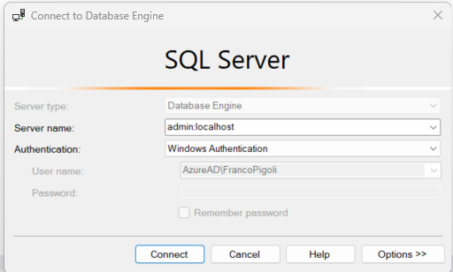

# DAC Dedicated Administrative Connection  Example

SQL server always retains a limited chunk of memory and other necessary resources to allow the DAC connection also when where no new connections are possible anymore because its resources are exhausted.

There is possobile only one DAC.

Via SSMS to create the DAC must be prefix the  server name with *admin:*



Via sqlcmd the *-A* command line option needs to be specified:

**C:\> sqlcmd -S . -A**

By default the DAC is only allowed from a machine where the instance is running

To permit a DAC from another machine in a network, the remote admin connections Server Configuration Option must be set:

``` SQL
sp_configure 'remote admin connection', 1
go
reconfigure
go
```

DAC is necessary also to read the system base tables.
