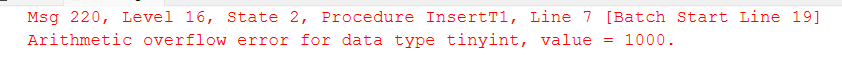
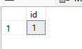

# Example of code for automatic Rollback if an error occured

## Set up enviroment

```SQL
create table #t (id tinyint);
GO
insert into #t values (1);
GO
```

## First Way (old manner)

use of **set xact_abort on**

The `SET XACT_ABORT ON` statement in SQL Server is used to specify whether SQL Server should roll back the entire transaction and abort the batch if a run-time error occurs.

```SQL
create procedure InsertData @valore int 
as
    set xact_abort on 
    BEGIN TRAN
        truncate table #t;

        insert into #t values(@valore);

    COMMIT
;
GO
```

## Second Way (new manner)

Use of **TRY - CATCH**

``` SQL
alter procedure InsertT1 @valore int 
as
 BEGIN TRY
    BEGIN TRAN
        truncate table #t

        insert into #t values(@valore)
    COMMIT
 END TRY
 BEGIN CATCH
    ROLLBACK;
    THROW;
 END CATCH
;
GO
```

### Test

```SQL

exec InsertData 9000 --- generate an arithmetic overflow error

select * from #t

```

In both case an error is generated but the rollback cancel the truncate and the table doesn't lose the data


