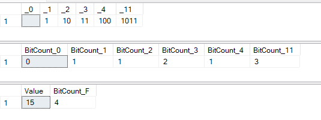
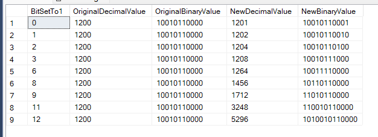
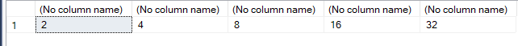
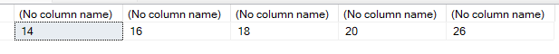
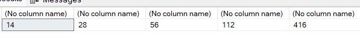
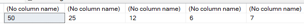

# Bit Manipulation Functions

- [Bit Manipulation Functions](#bit-manipulation-functions)
  - [Demo: utility functions](#demo-utility-functions)
  - [DEMO: BIT\_COUNT](#demo-bit_count)
  - [DEMO: GET\_BIT, SET\_BIT](#demo-get_bit-set_bit)
  - [RIGHT\_SHIFT, LEFT\_SHIFT](#right_shift-left_shift)

<https://learn.microsoft.com/en-us/sql/t-sql/functions/bit-manipulation-functions-overview>

**BIT_COUNT** takes one parameter and returns the number of bits set to 1 in that parameter as a bigint type

**GET_BIT** takes two parameters and returns the bit in expression_value that is in the offset defined by bit_offset

**SET_BIT** returns expression_value offset by the bit defined by bit_offset. The bit value defaults to 1, or is set by bit_value

**LEFT_SHIFT** takes two parameters, and returns the first parameter bit-shifted left by the number of bits specified in the second parameter

**RIGHT_SHIFT** takes two parameters, and returns the first parameter bit-shifted right by the number of bits specified in the second parameter

## Demo: utility functions

 ``` SQL
-- Utility Function to convert Binary to Decimal and viceversa

-- Convert Binary notation to a Decimal
CREATE FUNCTION dbo.BinaryToDecimal (@binaryString VARCHAR(MAX))
RETURNS INT
AS
BEGIN
    DECLARE @index INT = 0, @decimalNumber INT = 0, @length INT;

    SET @length = LEN(@binaryString);

    WHILE @index < @length
    BEGIN
        SET @decimalNumber = @decimalNumber + 
            CAST(SUBSTRING(@binaryString, @length - @index, 1) AS INT) * POWER(2, @index);
        SET @index = @index + 1;
    END

    RETURN @decimalNumber;
END
GO

-- Convert Decimal to aBinary notation
CREATE FUNCTION dbo.DecimalToBinary(@decimalNumber INT)
RETURNS VARCHAR(32) AS
BEGIN
    DECLARE @binaryString VARCHAR(32) = '';

    WHILE (@decimalNumber > 0)
    BEGIN
        SET @binaryString = CAST((@decimalNumber % 2) AS VARCHAR) + @binaryString;
        SET @decimalNumber = @decimalNumber / 2;
    END

    RETURN @binaryString;
END
GO

--- test
SELECT dbo.BinaryToDecimal('11001') AS DecimalNumber;
SELECT dbo.DecimalToBinary(25) AS BinaryString;
 ```

## DEMO: BIT_COUNT

 ``` SQL
-- Binary representation of some decimal numbers
select 
    dbo.DecimalToBinary(0) as _0,
    dbo.DecimalToBinary(1) as _1,
    dbo.DecimalToBinary(2) as _2,
    dbo.DecimalToBinary(3) as _3,
    dbo.DecimalToBinary(4) as _4,
    dbo.DecimalToBinary(11) as _11
;

--  Number of bits set to 1
select 
    BIT_COUNT (0) as BitCount_0,
    BIT_COUNT (1) as BitCount_1,
    BIT_COUNT (2) as BitCount_2,
    BIT_COUNT (3) as BitCount_3,
    BIT_COUNT (4) as BitCount_4,
    BIT_COUNT (11) as BitCount_11
;

select convert(int, 0xF) as DecimalValue, BIT_COUNT (0xF) as Count_BitSetTo1;
 ```



## DEMO: GET_BIT, SET_BIT

To the bit manipulation functions, bits are numbered from right to left, with bit 0 being the rightmost and the smallest and bit 7 being the leftmost and largest.

 ``` SQL
 
-- Set to 0 the first bit: change value from 11 (3) to 10 (2)
select 
    3 as InizialValue,  -- 11
    2 as FinalValue,    --10
    GET_BIT (3,0) as ZeroBitInizialValue,
    GET_BIT (SET_BIT (3,0,0),0) as ZeroBitFinalValue
    ;

-- Set to 1 the first bit (position zero)
select 
    dbo.DecimalToBinary(1200) as OriginalValue,  -- 10010110000
    SET_BIT (1200,0,1) as NewValue_Decimal, -- 10010110001
    dbo.DecimalToBinary(1201) as NewValue_Binary
    ;


--- example: Set bit
drop table if exists  #bit;
go

CREATE TABLE #bit(
    [BitSetTo1] [int] NOT NULL,
    [OriginalDecimalValue] [int] NOT NULL,
    [OriginalBinaryValue] [varchar](32) NULL,
    [NewDecimalValue] [int] NULL,
    [NewBinaryValue] [varchar](32) NULL
) 
;

GO

truncate table #bit;
go


-- decimal number 1200 is saved with 11 bit (10010110000)
-- Set to 1 bit from 0 to 12 
-- If a bit is not present in the original value, it adds new bits

DECLARE @i INT = 0;

WHILE (@i <= 12)
    BEGIN
        insert into #bit
        select 
        @i as BitSetTo1,
        1200 as OriginalDecimalValue,
        dbo.DecimalToBinary(1200) as OriginalBinaryValue,  -- 10010110000
        SET_BIT (1200,@i,1) as NewDecimalValue, -- 
        dbo.DecimalToBinary(SET_BIT (1200,@i,1)) as NewBinaryValue
        ;

    SET @i = @i + 1;

END;

select * 
from #bit
where OriginalBinaryValue <> NewBinaryValue
;

```



 ``` SQL
-- Example: useful to count the elements in active state
-- 10 items in 2 places

drop table if exists #BitValue;
GO

create table #BitValue (Place int, Items binary(2));
GO

-- At the begin all elements set to off
insert into #BitValue 
VALUES 
(1,0X00),(2,0x00)
GO

select Place, BIT_COUNT (Items), convert(int,Items) as CountOfActiveItems from #BitValue;


-- Activate some elements
update #BitValue set Items = SET_BIT (Items,4,1) where Place = 2;
update #BitValue set Items = SET_BIT (Items,1,1) where Place = 2;
update #BitValue set Items = SET_BIT (Items,0,1) where Place = 1;


-- Final state
select 
    Place, 
    BIT_COUNT (Items) as  CountOfActiveItems
from #BitValue
;


 ```

## RIGHT_SHIFT, LEFT_SHIFT

 ``` SQL
-- growth by powers of 2
SELECT
    LEFT_SHIFT(1, 1),
    LEFT_SHIFT(1, 2),
    LEFT_SHIFT(1, 3),
    LEFT_SHIFT(1, 4),
    LEFT_SHIFT(1, 5)
    ;
```



 ``` SQL
-- doubling of the value
SELECT
    LEFT_SHIFT(7, 1),
    LEFT_SHIFT(8, 1),
    LEFT_SHIFT(9, 1),
    LEFT_SHIFT(10, 1),
    LEFT_SHIFT(13, 1)
;
```



 ``` SQL
    -- multiply by powers of 2
SELECT
    LEFT_SHIFT(7, 1), -- 2 * 7
    LEFT_SHIFT(7, 2), -- 4 * 7
    LEFT_SHIFT(7, 3), -- 8 * 7
    LEFT_SHIFT(7,4),  -- 16 * 7
    LEFT_SHIFT(13,5)  -- 2**5 = 32 * 13 ==> 416
;
```



 ``` SQL
    -- dividing by powers of 2
SELECT
    RIGHT_SHIFT(100, 1),  -- 100 / 2
    RIGHT_SHIFT(100, 2),  -- 100 / 4
    RIGHT_SHIFT(100, 3),  -- 100 / 8
    RIGHT_SHIFT(100, 4),  -- 100 / 16  (6.25 ==> 6)
    RIGHT_SHIFT(31, 2)    -- 31 / 4  (7.75 ==> 7)
;
 ```

 
