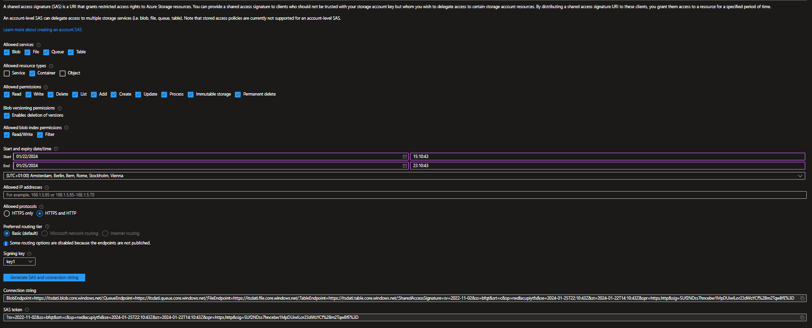

# Inport CSV files from Azure Container in a SQL Database

This Techniques could be used both on premise and azure

## Setup Enviroment

1. Create the Azure Storage Account es: `itsdati`
2. Create the Container in the Azure Storage Account es: `dati`

3. Create a SAS Access Signature to connect to the container


4. Copy the SAS string


`?sv=2022-11-02&ss=bfqt&srt=sco&sp=rwdlacupiytfx&se=2024-02-04T19:43:08Z&st=2024-01-22T11:43:08Z&spr=https,http&sig=QsxpGF8f11Y46%2BMpneREAU9%2FzHAt%2FlXTr9Z1CFQFb3Q%3D`

1. Create a file named `Dati.csv` with this data:

``` csv
codice,tipo,valore
alfa,t1,100
alfa,t2,200
bravo,t1,150
bravo,t3,400
charlie,t0,1200
```

4. Save the file in the container

5. Create in the database Test the table to insert CSV data

``` SQL
create table dbo.Dati
(
    [codice] varchar(100),
    [tipo] varchar(100),
    [valore] int
)
;
GO
```

## Import the csv data in Sql Table

``` SQL
use test
GO

-- one shot activity
CREATE MASTER KEY ENCRYPTION BY PASSWORD='India2033';
GO


CREATE DATABASE SCOPED CREDENTIAL ITSDataCredential
WITH 
    IDENTITY = 'SHARED ACCESS SIGNATURE',
    SECRET = '?sv=2022-11-02&ss=bfqt&srt=sco&sp=rwdlacupiytfx&se=2024-02-04T19:43:08Z&st=2024-01-22T11:43:08Z&spr=https,http&sig=QsxpGF8f11Y46%2BMpneREAU9%2FzHAt%2FlXTr9Z1CFQFb3Q%3D'
;
GO

CREATE EXTERNAL DATA SOURCE ITSDataSource
WITH 
(
    TYPE = BLOB_STORAGE, 
    LOCATION = 'https://itsdati.blob.core.windows.net/dati',
    CREDENTIAL = ITSDataCredential
)
;
GO


BULK INSERT dbo.Dati FROM 'dati.csv'
WITH 
(
    DATA_SOURCE = 'ITSDataSource',
    FORMAT = 'CSV', 
    FIRSTROW = 2, 
    FIELDTERMINATOR = ',', 
    ROWTERMINATOR = '\n', 
    TABLOCK
)
;

select top 30 * from Ddbo.Dati
```
