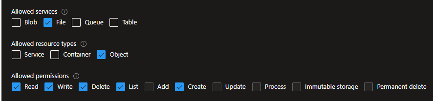
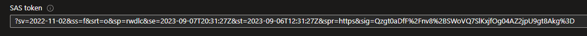
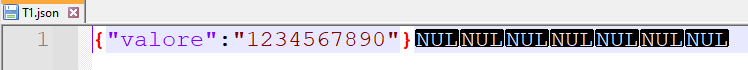

# Create, Read, and write in a file of an Azure fileshare 

The following article is a simple example of the application of the stored procedure `sp_invoke_external_rest_endpoint`. We will show you how to create, write, and read a file in an Azure fileshere.

Here the [documentation](<https://learn.microsoft.com/en-us/sql/relational-databases/system-stored-procedures/sp-invoke-external-rest-endpoint-transact-sql?view=azuresqldb-current&tabs=request-headers>) of the stored procedure.

- [Create, Read, and write in a file of an Azure fileshare](#create-read-and-write-in-a-file-of-an-azure-fileshare)
  - [Let's start](#lets-start)
  - [Example](#example)
    - [Create *database scope credential*  **(mandatory)**](#create-database-scope-credential--mandatory)
    - [Create a file](#create-a-file)
    - [Update a file](#update-a-file)
    - [Read a file](#read-a-file)
    - [Delete a file](#delete-a-file)


## Let's start

Given the fact that you already have a storage account on Azure and a fileshare.

You have to create the Shared Access Signature (SAS) token of the Storage Account with the following boxes checked



Mind the fact that during the creation steps of the SAS token you will have to declare a *due date*. This is the reason why you will have to edit the following code.

At the end of the generation process, copy the SAS token



## Example

### Create *database scope credential*  **(mandatory)**

Given the fact that in your database you already have created a `MASTER KEY`, you have to create a `database scoped credential` containing the SAS token


```SQL
-- Make sure a database master key exists if not, create it
if not exists(select * from sys.symmetric_keys where [name] = '##MS_DatabaseMasterKey##') 
begin
    create master key encryption by password = 'PapaZulu33!'
end

--  create a database scope credential named filestore
drop database scoped credential filestore;
go

create database scoped credential filestore
with identity = 'SHARED ACCESS SIGNATURE', 
secret = '?sv=2022-11-02&ss=bfqt&srt=sco&sp=rwdlacupiytfx&se=2023-09-03T21:41:20Z&st=2023-09-01T13:41:20Z&spr=https&sig=GqL3Ha5XeLgvsD3vLlEjOgIJjWSQEUT9iPUEPJnxCps%3D'
go

```

### Create a file

 In the following snippet we will create the file *T1.json* placed in the */dati/data* folder of the file share *datidemolab* of storage account *porinieducation*.

``` sql
declare @payload nvarchar(max) = '{"colore":"black","valore":20}';
declare @response nvarchar(max), @url nvarchar(max), @headers nvarchar(1000);
declare @len int = len (@payload);

set @url = 'https://porinieducation.file.core.windows.net/datidemolab/Dati/data/T1.json'

-- using the new function json_object to define the header
set @headers = json_object(
        'x-ms-type': 'file',
        'x-ms-content-length':cast(@len as varchar(9)),
        'Accept': 'application/xml')

exec sp_invoke_external_rest_endpoint
    @url = @url,
    @method = 'PUT',
    @headers = @headers,
    @credential = [filestore],
    @response = @response output
select cast(@response as xml);
go
```

> Remark: <br> 
As you can notice we declared the *payload* and then we computed the *length* of it. 
This is due to the fact that when we compile the header of the PUT request we have to provide the length of the file in the key `"x-ms-content-length"`.
As a result, the length of the file is set.

With the `PUT` request we are only creating an empty file.

### Update a file

The following script is an example on how to fill the file we created above. 

To highlight the lenght of the file we are currently using a shorter payload: the result should be that if you open the updated file you are going to see some `NUL` characters.

``` sql
declare @payload nvarchar(max) = '{"valore":"1234567890"}' ;
declare @response nvarchar(max), @url nvarchar(max), @headers nvarchar(1000);
declare @len int = len(@payload);

-- we want to write from the beginning of the file
set @headers = json_object(
        'x-ms-range': 'bytes=0-' + cast(@len-1 as varchar(9)),
        'x-ms-write': 'update',
        'Accept': 'application/xml');
set @url = 'https://porinieducation.file.core.windows.net/datidemolab/Dati/data/T1.json'
set @url += '?comp=range'
exec sp_invoke_external_rest_endpoint
    @url = @url,
    @method = 'PUT',
    @headers = @headers,
    @payload = @payload,
    @credential = [filestore],
    @response = @response output
select cast(@response as xml)
```

This is the result of the previous lines if you open the file using Notepad++.



The reason why we see the `NULL` characters is that the new string is much shorter than the one we used to create the file [here](#create-a-file).

### Read a file

Read the current result will give you an **ERROR** due to the special characters at the end of the file.

To test the reading you should open the file and delete everything after the "}" sign.

The output of the procedure is in JSON in the "result" key, or in XML in /output/result node.

- **JSON** 
```sql
declare @ret int, @response nvarchar(max), @url nvarchar(max)

set @url = 'https://porinieducation.file.core.windows.net/datidemolab/Dati/data/T1.json'

exec @ret =  sp_invoke_external_rest_endpoint
    @url = @url,
    @headers = '{"Accept":"application/json"}',
    @credential = filestore,
    @method = 'GET',
    @response = @response output

select @response, json_query(@response, '$.result') as FileContent
go
```

- **XML**
```sql
declare @ret int, @response nvarchar(max), @url nvarchar(max);

set @url = 'https://porinieducation.file.core.windows.net/datidemolab/Dati/data/T1.json'

exec @ret =  sp_invoke_external_rest_endpoint
    @url = @url,
    @headers = '{"Accept":"application/xml"}',
    @credential = filestore,
    @method = 'GET',
    @response = @response output

select cast(@response as xml)

declare @x xml = convert (xml,@response);
select 
    @ret AS ReturnCode,
    @x.value ('(/output/result)[1]','nvarchar(max)')
go
```

### Delete a file

At the end of this tutorial, we can finally remove the *T1.json* file using the `DELETE` method.

```sql
declare @response nvarchar(max), @url nvarchar(max), @headers nvarchar(1000);

set @url = 'https://porinieducation.file.core.windows.net/datidemolab/Dati/data/T1.json'
set @headers = json_object(
        'x-ms-type': 'file',
        'Accept': 'application/xml')

exec sp_invoke_external_rest_endpoint
    @url = @url,
    @method = 'DELETE',
    @headers = @headers,
    @credential = [filestore],
    @response = @response output
select cast(@response as xml);
go
```