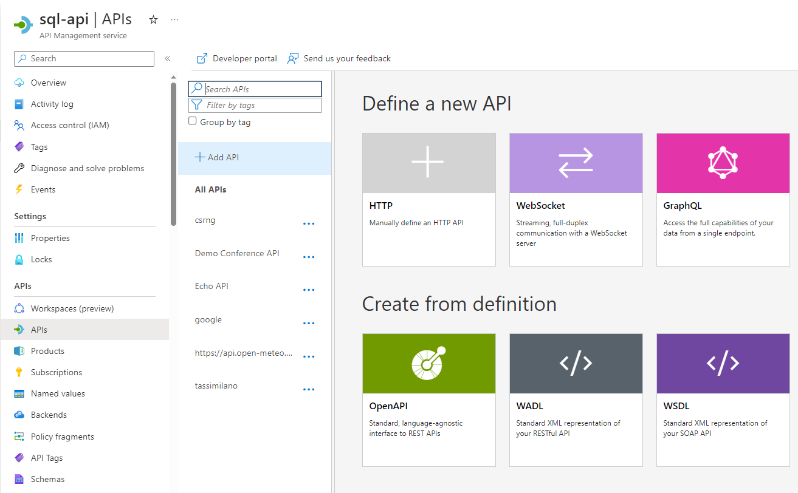
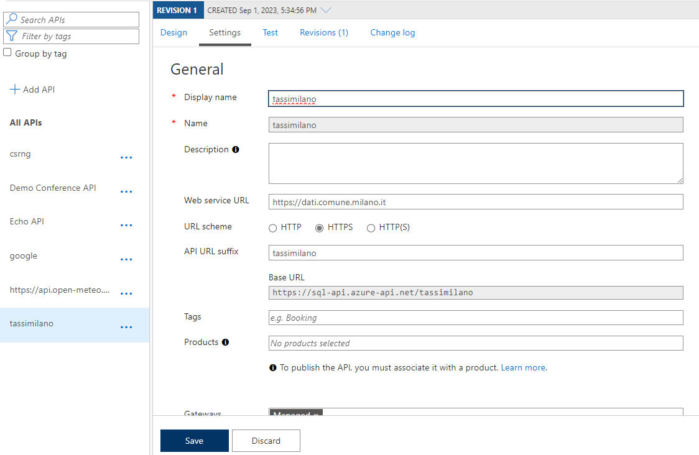
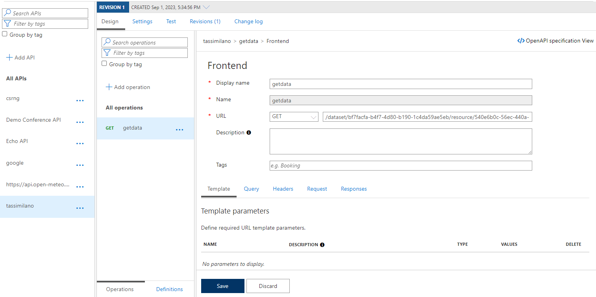
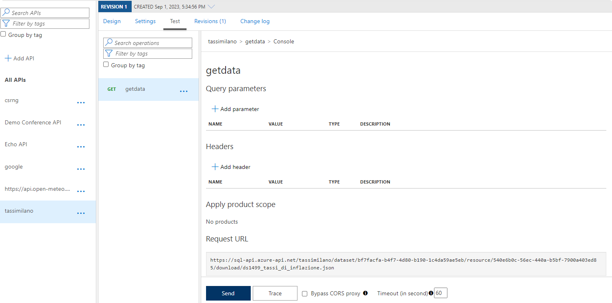
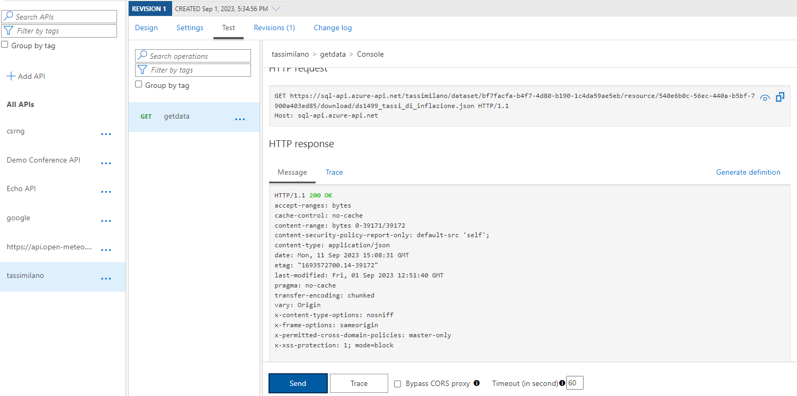
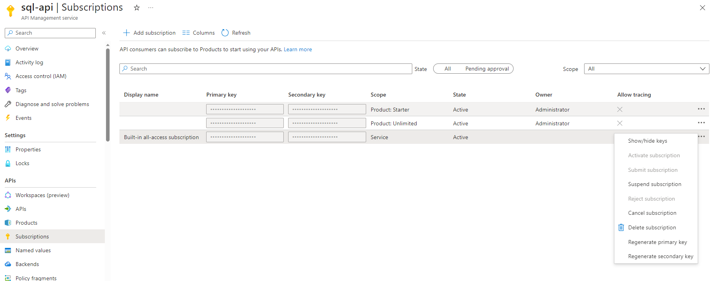

# Reading a public web API

The following article is a simple example of the application of the stored procedure `sp_invoke_external_rest_endpoint`. We will show you how to access, read and use the response of any web API  you can find online.

Here the [documentation](<https://learn.microsoft.com/en-us/sql/relational-databases/system-stored-procedures/sp-invoke-external-rest-endpoint-transact-sql?view=azuresqldb-current&tabs=request-headers>) of the stored procedure.

- [Reading a public web API](#reading-a-public-web-api)
  - [API Management Service - setup](#api-management-service---setup)
  - [Azure SQL Database](#azure-sql-database)


In this tutorial we are going to use link 

[https://sql-api.azure-api.net/tassimilano/dataset/bf7facfa-b4f7-4d80-b190-1c4da59ae5eb/resource/540e6b0c-56ec-440a-b5bf-7900a403ed85/download/ds1499_tassi_di_inflazione.json](https://sql-api.azure-api.net/tassimilano/dataset/bf7facfa-b4f7-4d80-b190-1c4da59ae5eb/resource/540e6b0c-56ec-440a-b5bf-7900a403ed85/download/ds1499_tassi_di_inflazione.json) 

that is a public API provided from the italian region Lombardy. The result is a JSON that we are going to read from an Azure SQL.

## API Management Service - setup

Since we are going to query a public content usign our Azure SQL database we need to build an architecture to manage and control the service. Specifically the stored procedure is able to take advantage of the [API Management Service](https://learn.microsoft.com/en-us/azure/api-management/api-management-key-concepts).

As a first step we are going to set the service up.

> Remark: the deploymeny of the API Management Service takes up to 1h and 30 mins.

The deployment used the standard setup.

Once the deploy is completed you should open the resource and go in the APIs section and *click* on the `+ Add API`:

Select the generic HTTP model and provide the following settings to configure it


During the setup of the API the most important information is the `web service URL`.
As you can see from the previous example we are indicating just the root of the public API that will be wrapped in the Azure service.
We setted up the `DisplayName` and the `Name`, all the other options was left to the default settings.

> Remark: be aware if the link you are using as a test is using the HTTP or HTTPS scheme.

> Remark: **Base URL** is the endpoint we are going to send our requests.

Once the objet is created we need to associate an action and a structure to the service. 
As an example we would like to configure a `GET` action that will response with the JSON listed above in this page.

To configure the action select the object *tassimilano* and follow the steps:

1. Select `Design`
2. select `+ Add operation`
3. insert any kind of displayname you may wish and insert the correct navigation in the original public API. This navigation will be concatenated to the original web site we just configured in the steps above.



Once you are done you can now decide to test the link in the Azure portal.

1. go in the `Test` section
2. select the operation you want to test
3. in this example we are not using any kind of parameters, otherwise we should compile all the required option
4. Finally, you can *click* on `Send`.



If the result is ```200``` then you are ready to test this in your Azure SQL database



## Azure SQL Database

Since we are going to create a database scoped credential make sure a database `MASTER KEY` exists:

``` sql
if not exists(select * from sys.symmetric_keys where [name] = '##MS_DatabaseMasterKey##') begin
    create master key encryption by password = 'LONg_Pa$$_w0rd!'
end
```

Then create the `database scoped credential`. 
- This object's name should be our service's root name: the `Base URL` indicated during the [setting process](REST_Read_externalresources.md#api-management-service---setup). 
For more details: follow the [Credential name rules](<https://learn.microsoft.com/en-gb/sql/relational-databases/system-stored-procedures/sp-invoke-external-rest-endpoint-transact-sql?view=azuresqldb-current&tabs=request-headers#credential-name-rules>).
- The secret is the `subscription key` of the API Management Service. You should *click* on the ellipsis of the key you want to use, then on the `Show/hide keys` and finally copy one of the available keys.


This is the code you should update,

``` sql
if exists(select * from sys.database_scoped_credentials where [name] = 'https://sql-api.azure-api.net/tassimilano') begin
    drop database scoped credential [https://sql-api.azure-api.net/tassimilano];
end
create database scoped credential [https://sql-api.azure-api.net/tassimilano]
with identity = 'HTTPEndpointHeaders', secret = '{"Ocp-Apim-Subscription-Key":"<PLACE-THE-KEY-HERE>"}';
go
```


Finally, we can use the stored procedure to retrieve the data provided from the web API

```sql
declare @ret int, @response nvarchar(max), 
		@root nvarchar(max), @action nvarchar(max),
		@finalurl nvarchar(max);

set @root = 'https://sql-api.azure-api.net/tassimilano'
set	@action = '/dataset/bf7facfa-b4f7-4d80-b190-1c4da59ae5eb/resource/540e6b0c-56ec-440a-b5bf-7900a403ed85/download/ds1499_tassi_di_inflazione.json'
set @finalurl = @root + @action

exec @ret = sp_invoke_external_rest_endpoint
    @url = @finalurl,
    @method = 'GET', 
    @credential = [https://sql-api.azure-api.net/tassimilano],
    @response = @response OUTPUT
select 
    @ret as ReturnCode,     
    @response as Response,
    json_query(@response, '$.result') as Result;
```