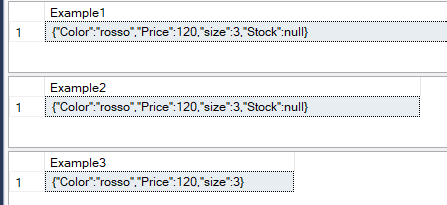

# What's new in TSQL SQL Server 2022 (ver.16)

<https://learn.microsoft.com/en-us/sql/sql-server/what-s-new-in-sql-server-2022>

- [What's new in TSQL SQL Server 2022 (ver.16)](#whats-new-in-tsql-sql-server-2022-ver16)
  - [GENERATE\_SERIES](#generate_series)
  - [DATE\_BUCKET](#date_bucket)
  - [FIRST\_VALUE, LAST\_VALUE (IGNORE NULLS | RESPECT NULLS)](#first_value-last_value-ignore-nulls--respect-nulls)
  - [GREATEST, LEAST](#greatest-least)
  - [TRIM, LTRIM, RTRIM](#trim-ltrim-rtrim)
  - [JSON\_OBJECT, JSON\_ARRAY](#json_object-json_array)
    - [JSON\_OBJECT](#json_object)
    - [JSON\_ARRAY](#json_array)
  - [DATETRUNC](#datetrunc)

## GENERATE_SERIES

<https://learn.microsoft.com/en-us/sql/t-sql/functions/generate-series-transact-sql>

GENERATE_SERIES ( start , stop [ , step ] )

Generates a series of numbers within a given interval. The interval and the step between series values are defined by the user.

The parameters must be numeric and all of the same data type

``` SQL
select * from GENERATE_SERIES ( 1,10,1);

select * from GENERATE_SERIES ( 1.,2.,0.1);

select * from GENERATE_SERIES ( 100, 0,-25 );
```


``` SQL
-- if the step does not allow the final value to be reached exactly, it stops first

select * from GENERATE_SERIES ( 10, 0,-3 );
select * from GENERATE_SERIES ( 1, 11,4 );

```


## DATE_BUCKET

<https://learn.microsoft.com/en-us/sql/t-sql/functions/date-bucket-transact-sql>

DATE_BUCKET (datepart, number, date [, origin ] )

DATE_BUCKET returns the date-time value corresponding to the start of each date-time bucket from the timestamp defined by the origin parameter, or the default origin value of 1900-01-01 00:00:00.000 if the origin parameter isn't specified.

Useful to aggregate records in a custom time intervals

``` SQL

-- dati di esempio 
drop table if exists #ExampleDate;
GO

select 
 dateadd(second, 30 * RAND(CHECKSUM(NEWID())), dateadd(minute,value,'20221001')) as momento ,
 convert(numeric(6,4),100 * RAND(CHECKSUM(NEWID()))) as Valore
 into #ExampleDate
from 
 GENERATE_SERIES (0,2000,1)
;

select top 20 * from #ExampleDate order by momento;

 -- aggregazione ogni 27 minuti
SELECT
    DATE_BUCKET(MINUTE,27,momento,convert(datetime,'20221001')) as Fase,
    sum (valore) as SommaValore,
    avg(valore) as MediaValore,
    stdev(valore) as DevStdValore
  FROM #ExampleDate
  GROUP BY DATE_BUCKET(MINUTE,27,momento,convert(datetime,'20221001'))
GO
```


``` SQL

-- DATE_BUCKET e Windows Forms all'interno del bucket temporale
 SELECT 
    Momento, Valore,
    DATE_BUCKET(MINUTE,27,momento,convert(datetime,'20221001')) as Fase,
    count(valore) over (partition by DATE_BUCKET(MINUTE,27,momento),convert(datetime,'20221001')) as NumeroItem,
    sum(valore) over (partition by DATE_BUCKET(MINUTE,27,momento),convert(datetime,'20221001')) as SommaValore,
    avg (valore) over (partition by DATE_BUCKET(MINUTE,27,momento),convert(datetime,'20221001')) as MediaValore,
    PERCENTILE_CONT(.5) WITHIN GROUP (ORDER BY valore) over (partition by DATE_BUCKET(MINUTE,27,momento),convert(datetime,'20221001'))  AS MedianaValore,
    PERCENTILE_CONT(.25) WITHIN GROUP (ORDER BY valore) over (partition by DATE_BUCKET(MINUTE,27,momento),convert(datetime,'20221001'))  AS Q1Valore

FROM 
    #ExampleDate
ORDER BY
    momento
;
```


## FIRST_VALUE, LAST_VALUE (IGNORE NULLS | RESPECT NULLS)

<https://learn.microsoft.com/en-us/sql/t-sql/functions/first-value-transact-sql>

<https://learn.microsoft.com/en-us/sql/t-sql/functions/last-value-transact-sql>

FIRST_VALUE ( [scalar_expression ] )  [ IGNORE NULLS | RESPECT NULLS ]
    OVER ( [ partition_by_clause ] order_by_clause [ rows_range_clause ] )

LAST_VALUE ( [ scalar_expression ] )  [ IGNORE NULLS | RESPECT NULLS ]
    OVER ( [ partition_by_clause ] order_by_clause [ rows_range_clause ] )

Returns the first value or the last value in an ordered set of values.

IGNORE NULLS - Ignore null values in the dataset when computing the last value over a partition.
RESPECT NULLS - Respect null values in the dataset when computing last value over a partition.

``` SQL

-- example data
drop table if exists #ExampleDate;
GO


SELECT Id,Gruppo, Valore
into #ExampleDate
FROM (VALUES 
(1,'A', 20.3), (2,'B', 22.1), (3,null,4.5), (4,'C', 8.2), 
(5,'D', 10.6) ,(6,null, 19.3),(7,null, 14.6),(8,'E',22.6)
) AS t (Id,Gruppo, Valore)
;

select * from #ExampleDate;

-- IGNORE NULLS: if null the previous value is used (dragging)
select
    Id,Gruppo, Valore,
    last_value(Gruppo) IGNORE NULLS 
    over (order by Id rows between unbounded preceding and current row) as GruppoCalcolato
from 
    #ExampleDate
order by Id

-- RESPECT NULLS: if null value is not calculated
select
    Id,Gruppo, Valore,
    last_value(Gruppo) RESPECT NULLS 
    over (order by Id rows between unbounded preceding and current row) as GruppoCalcolato
from 
    #ExampleDate
order by Id
```


## GREATEST, LEAST

<https://learn.microsoft.com/en-us/sql/t-sql/functions/logical-functions-greatest-transact-sql?view=azure-sqldw-latest>
<https://learn.microsoft.com/en-us/sql/t-sql/functions/logical-functions-least-transact-sql?view=azure-sqldw-latest>

GREATEST: returns the maximum value from a list of one or more expressions
LEAST: returns the minimum value from a list of one or more expressions

``` SQL

select 
    LEAST ('Alfa','Zulu','Bravo','Golf') as Least1,
    GREATEST ('Alfa','Zulu','Bravo','Golf') as Greatest1,
    LEAST (5,8,3) as Least2,
    GREATEST (5,8,3) as Greatest2
    ;
GO

declare @d1 date = '20220703';
declare @d2 date = '20220204';
declare @d3 date = '20210723';
declare @d4 date = '20221213';

select LEAST (@d1,@d2,@d3,@d4),GREATEST(@d1,@d2,@d3,@d4);

-- The scale of the return type is determined by the scale of the argument with the highest precedence data type
SELECT 
    LEAST('6.62', 3.1415, N'7') AS LeastVal, 
    GREATEST('6.62', 3.1415, N'7') AS GreatVal; 
GO
```


## TRIM, LTRIM, RTRIM

<https://learn.microsoft.com/en-us/sql/t-sql/functions/trim-transact-sql>
<https://learn.microsoft.com/en-us/sql/t-sql/functions/rtrim-transact-sql>
<https://learn.microsoft.com/en-us/sql/t-sql/functions/ltrim-transact-sql>

LTRIM ( character_expression , [ characters ] )

Now it's possible to indicate the characters to remove before or after.
It's also possible to continue to use the old syntax without indicating the characters to remove, in this case the blanks will be removed.

``` SQL
-- New sintax with characters to remove
SELECT TRIM( 'xyz' from 'xz1111111xyzxyz' )  -- default before and after

SELECT TRIM(LEADING ('xyz') from 'xz1111111xyzxyz')    -- remove at beginning
SELECT TRIM(TRAILING ('xyz') from 'xz1111111xyzxyz')  -- remove ad the end
SELECT TRIM(BOTH  ('xyz') from 'xz1111111xyzxyz')      -- remove at the beginning and at the end

select TRIM(TRAILING ('euro') from '12345Euro')

-- Old syntax without indicating the characters to remove. In this case the blanks will be removed
select trim (' kk ')  -- ==> 'kk'

```


``` SQL
-- Old syntax without indicating the characters to remove. In this case the blanks will be removed
select trim (' kk ')  -- ==> 'kk'
```

## JSON_OBJECT, JSON_ARRAY

### JSON_OBJECT

Constructs JSON object text from zero or more expressions.
<https://learn.microsoft.com/en-us/sql/t-sql/functions/json-object-transact-sql>

``` SQL
SELECT JSON_OBJECT('Color':'rosso', 'Price':120, 'size':3,'Stock':null) as 'Example1';
SELECT JSON_OBJECT('Color':'rosso', 'Price':120, 'size':3,'Stock':null NULL ON NULL) as 'Example2';
SELECT JSON_OBJECT('Color':'rosso', 'Price':120, 'size':3,'Stock':null ABSENT ON NULL) as 'Example3';
```



``` SQL
with cteExampleData as
(
SELECT Id,Gruppo, Valore
FROM (VALUES 
(1,'A', 20.3), (2,'B', 22.1), (3,null,4.5), (4,'C', 8.2), 
(5,'D', 10.6) ,(6,null, 19.3),(7,null, 14.6),(8,'E',22.6)
) AS t (Id,Gruppo, Valore)
)

select JSON_OBJECT( 'Id':a.Id, 'Gruppo':a.Gruppo,'Valore':a.Valore)
from cteExampleData a
;
```


### JSON_ARRAY

Constructs JSON array text from zero or more expressions
<https://learn.microsoft.com/en-us/sql/t-sql/functions/json-array-transact-sql>

``` SQL
select JSON_ARRAY ('alfa','bravo','charlie');
GO
```


``` SQL
with cteArea as
(
SELECT Gruppo, Valore
FROM (VALUES 
('Alfa', 20.3), ('Bravo', 22.1), ('Charlie', 8.2), 
('Delta', 10.6) ,('Echo', 19.3),('Foxtrot', 14.6)
) AS a (Gruppo, Valore)
),
cteNegozi as
(
SELECT Gruppo, Negozio
FROM (VALUES 
('Alfa', 'N01'),('Alfa', 'N02'),('Alfa', 'N03'),('Bravo', 'N04'),('Bravo', 'N05'),
('Charlie', 'N06'),('Delta', 'N07'),('Delta', 'N08')
) as b (Gruppo, Negozio)
)

select 
    JSON_OBJECT( 'Gruppo':n.Gruppo, 'Valore':a.Valore,'Negozi':JSON_ARRAY(string_Agg(n.Negozio,','))) as JsonData,
    n.Gruppo,
    a.Valore,
    JSON_ARRAY(string_Agg(n.Negozio,',')) as Negozi
from cteArea a
    inner join 	cteNegozi n 
    on a.Gruppo =n.Gruppo
group by n.Gruppo,a.Valore
;
```


## DATETRUNC

<https://learn.microsoft.com/en-us/sql/t-sql/functions/datetrunc-transact-sql>

DATETRUNC ( datepart, date )
The DATETRUNC function returns an input date truncated to a specified datepart

``` SQL
DECLARE @d datetime2 = '2021-12-08 11:30:15.1234567';
SELECT 
    'Year' = DATETRUNC(year, @d),
    'Quarter'= DATETRUNC(quarter, @d),
    'Month'= DATETRUNC(month, @d),
    'Week'= DATETRUNC(week, @d), -- Using the default DATEFIRST setting value of 7 (U.S. English)
    'Iso_week' = DATETRUNC(iso_week, @d),
    'DayOfYear'= DATETRUNC(dayofyear, @d),
    'Day' = DATETRUNC(day, @d);

 select
    'Hour'= DATETRUNC(hour, @d),
    'Minute'= DATETRUNC(minute, @d),
    'Second'= DATETRUNC(second, @d),
    'Millisecond' = DATETRUNC(millisecond, @d),
    'Microsecond'= DATETRUNC(microsecond, @d);

```


The week number depends by value of DATEFIRST option

``` SQL
DECLARE @d date = '20230502';

SELECT 'Week-7', DATETRUNC(week, @d); -- Uses the default DATEFIRST setting value of 7 SUNDAY (U.S. English)

SET DATEFIRST 1;  --- Monday
SELECT 'Week-1', DATETRUNC(week, @d);

SET DATEFIRST 3; -- Wednesday
SELECT 'Week-3', DATETRUNC(week, @d);
```


