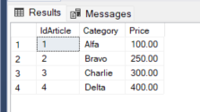
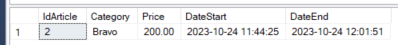
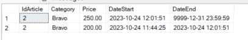
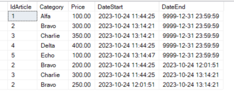
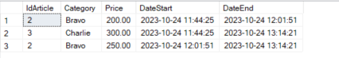
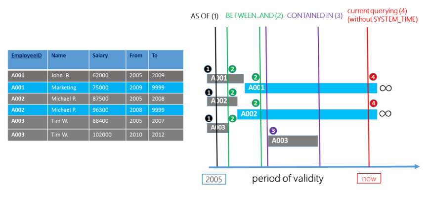

# **Temporal Table** (system-versioned temporal tables)

[Documentation Microsoft Docs](https://learn.microsoft.com/en-us/sql/relational-databases/tables/temporal-tables)

- [**Temporal Table** (system-versioned temporal tables)](#temporal-table-system-versioned-temporal-tables)
  - [Creation the temporal table](#creation-the-temporal-table)
    - [Initial environmental cleaning](#initial-environmental-cleaning)
    - [Table creation](#table-creation)
    - [Example of utilization](#example-of-utilization)
    - [Deleting table](#deleting-table)
  - [Changing to a temporal table a table with historical data that exists](#changing-to-a-temporal-table-a-table-with-historical-data-that-exists)
  - [Example of query on temporal query](#example-of-query-on-temporal-query)
    - [How to get time in the insertion time zone](#how-to-get-time-in-the-insertion-time-zone)
  - [Limitations of Temporal tables](#limitations-of-temporal-tables)

## Creation the temporal table

The time table must have the following requirements:

- must have a primary key
- must 2 fields of type datetime2 declared GENERATED ALWAYS AS ROW START / END
- a PERIOD SYSTEM_TIME attribute defined on the two datetime2 fields

### Initial environmental cleaning

``` SQL

-- Set Active Database for testing
Use Test
GO

IF OBJECT_ID(N'dbo.Articles', N'U') IS NOT NULL
BEGIN
 IF OBJECTPROPERTY(OBJECT_ID(N'dbo.Articles', N'U'), N'TableTemporalType') = 2
    ALTER TABLE dbo.Articles SET ( SYSTEM_VERSIONING = OFF );
 DROP TABLE IF EXISTS dbo.Articles, dbo.ArticlesHistory;
END;

```


### Table creation

``` SQL
create table dbo.Articles
(
 IdArticle int not null CONSTRAINT PK_IdArticle PRIMARY KEY NONCLUSTERED,
 Category varchar(50),
 Price numeric (8,2),

 DateStart DATETIME2(0) GENERATED ALWAYS AS ROW START HIDDEN NOT NULL, -- hidden attribute is optional 
 DateEnd   DATETIME2(0) GENERATED ALWAYS AS ROW END   HIDDEN NOT NULL, -- hidden attribute is optional 
 PERIOD FOR SYSTEM_TIME (DateStart, DateEnd),
)
WITH ( SYSTEM_VERSIONING = ON ( HISTORY_TABLE = dbo.ArticlesHistory ) ); -- the name of history table is optional. If not indicated the name of history table is generated automatically
;
GO

```

### Example of utilization

``` SQL
select * from dbo.Articles
select * from dbo.ArticlesHistory

-- Insert some data
insert into dbo.Articles
values (1,'Alfa',100),(2,'Bravo',200),(3,'Charlie',300), (4,'Delta',400);
GO

select * from dbo.Articles;
select * from dbo.ArticlesHistory; -- historical table is empty
GO

-- update record
update dbo.Articles set Price = Price + 50 where IdArticle in(2);
GO

select * from dbo.Articles;
select * from dbo.ArticlesHistory ;  -- date are stored in the UTC time zone
GO
```





```SQL

-- With for system_time all option all record actual and storical are retrieved

select *, DateStart,DateEnd 
from dbo.Articles for system_time all
where IdArticle=2
order by DateStart desc
```



```SQL

update dbo.Articles set Price = Price + 50 where IdArticle in(2,3);
GO

-- new articles
insert into dbo.Articles values (5,'Echo',100);
GO

select *, DateStart,DateEnd from dbo.Articles for system_time all

select * from dbo.ArticlesHistory -- the new article (Echo) is not present in historic table

```



the new article (Echo) is not present in historic table



### Deleting table

To delete a Temporal Table the system version must be set to off.
Data table and Historical table must be delete separately

```SQL
IF OBJECT_ID(N'dbo.Articles', N'U') IS NOT NULL
BEGIN
 IF OBJECTPROPERTY(OBJECT_ID(N'dbo.Articles', N'U'), N'TableTemporalType') = 2
    ALTER TABLE dbo.Articles SET ( SYSTEM_VERSIONING = OFF );
 DROP TABLE IF EXISTS dbo.Articles, dbo.ArticlesHistory;
END;
GO
```

## Changing to a temporal table a table with historical data that exists

```SQL

-- Creation the table with historical data of example
create table dbo.ArticlesHistory
(
   IdArticle int not null,
   Category varchar(50),
   Price numeric (8,2),
   DateStart DATETIME2(0) NOT NULL,
   DateEnd   DATETIME2(0) NOT NULL
);
GO


-- Inserting historical data  (Do not insert data of the future)
declare @DateStart datetime = '20210101';
insert into dbo.ArticlesHistory
values
(1,'alfa',1000,dateadd (month,0,@DateStart),dateadd (month,1,@DateStart)),
(1,'alfa',2000,dateadd (month,1,@DateStart),dateadd (month,2,@DateStart)),
(1,'alfa',3000,dateadd (month,2,@DateStart),dateadd (month,3,@DateStart)),
(1,'alfa',4000,dateadd (month,3,@DateStart),dateadd (month,4,@DateStart)),
(1,'alfa',5000,dateadd (month,4,@DateStart),dateadd (month,5,@DateStart)),
(1,'alfa',6000,dateadd (month,5,@DateStart),dateadd (month,6,@DateStart)),
(1,'alfa',7000,dateadd (month,6,@DateStart),dateadd (month,7,@DateStart)),
(1,'alfa',8000,dateadd (month,7,@DateStart),dateadd (month,8,@DateStart))
;
GO

update dbo.ArticlesHistory
set DateStart = DATEADD (second,1,Datestart);
GO


-- Table with current data
drop table if exists dbo.Articles;
GO

create table dbo.Articles
(
   IdArticle int not null primary key,
   Category varchar(50),
   Price numeric (8,2),
   DateStart DateTime2(0) not  null,
   DateEnd DateTime2(0) not null
);
GO

insert into dbo.Articles 
select top 1 IdArticle,Category,Price,DateEnd,'99991231 23:59:59' from dbo.ArticlesHistory order by DateStart desc;
GO

select * from dbo.Articles;
select * from  dbo.ArticlesHistory;

-- modifiche alla tabella per renderla Temporal
ALTER TABLE dbo.Articles ADD PERIOD FOR SYSTEM_TIME (DateStart, DateEnd);

ALTER TABLE dbo.Articles ALTER COLUMN DateStart ADD HIDDEN; -- solo estetiche
ALTER TABLE dbo.Articles ALTER COLUMN DateEnd ADD HIDDEN;

ALTER TABLE dbo.Articles
  SET ( SYSTEM_VERSIONING = ON ( HISTORY_TABLE = dbo.ArticlesHistory ) );
GO
```

## Example of query on temporal query

**The possible values for option FOR SYSTEM_TIME are:**

- **AS OF** *date_time*: Returns the rows containing the values that were current at the specified point in time in the past. <u>ValidFrom <= date_time AND ValidTo > date_time</u>

- **FROM** *start_date_time* **TO** *end_date_time*: Returns all the row versions that were active within the specified time range. 
   <u>ValidFrom < end_date_time AND ValidTo > start_date_time</u>

- **BETWEEN** *start_date_time* **AND** *end_date_time*: Returns all the row versions that were active within the specified time range except the table of rows returned includes rows that became active on the upper boundary defined by the end_date_time endpoint.
<u>ValidFrom <= end_date_time AND ValidTo > start_date_time></u>

- **CONTAINED IN** (start_date_time, end_date_time): Return all rows versions that were opened and closed within the specified time range defined by the two period values.
<u>ValidFrom >= start_date_time AND ValidTo <= end_date_time</u>

- **ALL** Returns all the rows, both current and historic

If FOR SYSTEM_TIME is not indicated only current value are returned, like usual query on non temporal table.



```SQL

-- another update
update dbo.Articles set Price = 8001 where IdArticle=1;
insert into dbo.Articles values (2,'bravo',100);
go

select * from dbo.Articles; -- current values

select *, DateStart, DateEnd 
from dbo.Articles  
FOR SYSTEM_TIME ALL; -- all values: historical and current

-- Data at specific time
select * from dbo.Articles FOR SYSTEM_TIME AS OF '2021-02-02 00:00:00';
select * from dbo.Articles FOR SYSTEM_TIME AS OF '2021-03-02 00:00:00';

--Date interval

-- BETWEEN: overlapping data that existed before and ends after
select * from dbo.Articles  FOR SYSTEM_TIME FROM '2021-02-01 00:00:00' TO '2021-04-01 00:00:00'; 
select * from dbo.Articles  FOR SYSTEM_TIME BETWEEN '2021-02-01 00:00:00' AND '2021-04-01 00:00:00';  
select * from dbo.Articles  FOR SYSTEM_TIME BETWEEN '2021-02-01 00:00:00' AND '2021-03-31 23:59:59'; 


-- CONTAINED: data that exists within the period
select *, DateStart, DateEnd from dbo.Articles  FOR SYSTEM_TIME CONTAINED IN ('20210201' , '20210401');
select *, DateStart, DateEnd from dbo.Articles  FOR SYSTEM_TIME CONTAINED IN ('20210201' , '2021-03-31 23:59:59');

select * from dbo.Articles  FOR SYSTEM_TIME ALL; -- tutta la storia

-- delete record
delete from dbo.Articles where IdArticle=1;
GO

select * from  dbo.Articles;

 -- deleted data history remains
 select *, DateStart, DateEnd  
 from dbo.Articles  FOR SYSTEM_TIME ALL;

-- insert again a data with same primary key value
insert into dbo.Articles values (1,'zulu',1900);

select * from  dbo.Articles;

-- the period without that date is recorded
select *, DateStart, DateEnd  
from dbo.Articles  FOR SYSTEM_TIME ALL
where IdArticle=1
order by IdArticle, DateStart desc;  

select * from dbo.Articles for system_time as of '20220501 12:43:00';

```

### How to get time in the insertion time zone

All dates and times in the Historic Table are recorded in UTC Time.

To get data in the other time zone you could use AT TIME ZONE option

```SQL
-- List of Time Zone
-- select * from sys.time_zone_info

SELECT *,
  DateStart AT TIME ZONE 'UTC' AT TIME ZONE 'Central European Standard Time' AS DateStart,
  CASE
    WHEN DateEnd = '9999-12-31 23:59:59'
      THEN DateEnd AT TIME ZONE 'UTC'
    ELSE DateEnd AT TIME ZONE 'UTC' AT TIME ZONE 'Central European Standard Time'
  END AS DateEnd
FROM 
   dbo.Articles FOR SYSTEM_TIME ALL;

select * from dbo.Articles for system_time as of '20220501 12:43:00';

declare @momento datetime2;
set @momento = (select  convert (datetime2,'20220501 14:43:00') AT TIME ZONE 'Central European Standard Time' AT TIME ZONE 'UTC')
select @momento;

select * from dbo.Articles for system_time as of @momento;
select * from dbo.Articles for system_time as of '20220501 12:43:00';

```

## Limitations of Temporal tables

- It is not possible to make a TRUNCATE
- The data in the historical table can not be changed
- It is not possible to add constraints to the historical table
