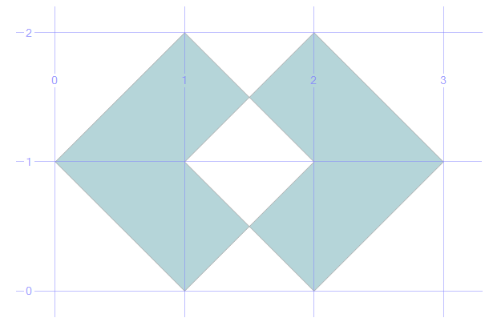
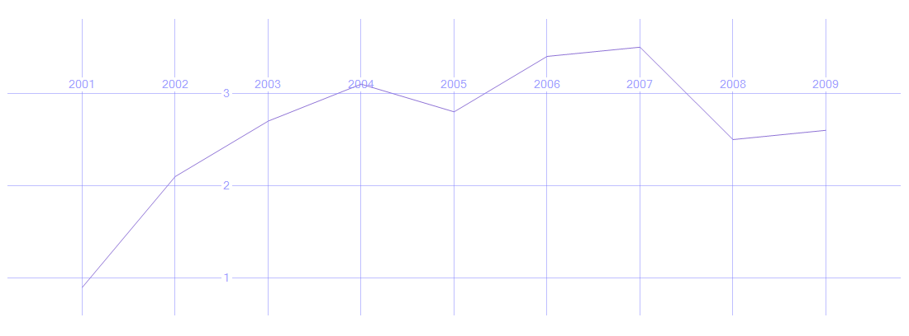
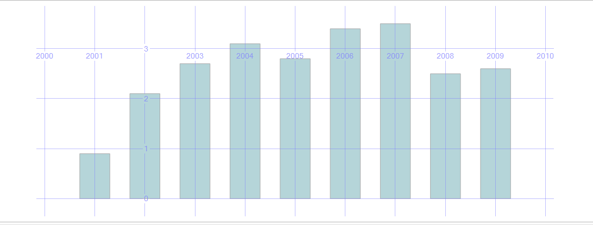

# Example of Geometry Data Type

<https://learn.microsoft.com/en-us/sql/relational-databases/spatial/spatial-indexes-overview>

```SQL

-- POLYGON
SELECT geometry::STGeomFromText('GEOMETRYCOLLECTION(POLYGON((0 0, 100 0, 100 100, 0 100, 0 0)))', 0)

-- Lines
DECLARE @g geometry;  
SET @g = geometry::STGeomFromText('LINESTRING (100 100, 20 180, 180 180)', 0);  
SELECT @g.ToString(); 
Select @g;
 
select geometry::STGeomFromText('LINESTRING (1 2, 2 4, 3 2, 4 4, 5 2, 6 4)', 0);  

-- Circle
DECLARE @g2 geometry ='CIRCULARSTRING (1 1, 2 1, -1 1.3)';
select @g2

-- MultiPolygon
DECLARE @g1 geometry ='MultiPolygon(((2 0, 3 1, 2 2, 1.5 1.5, 2 1, 1.5 0.5, 2 0)), ((1 0, 1.5 0.5, 1 1, 1.5 1.5, 1 2, 0 1, 1 0)))';
select @g1
```



```SQL
CREATE TABLE #Sales( FY INT, Sales FLOAT )
INSERT #Sales( FY, Sales ) VALUES( 2001, 0.9 )
INSERT #Sales( FY, Sales ) VALUES( 2002, 2.1 )
INSERT #Sales( FY, Sales ) VALUES( 2003, 2.7 )
INSERT #Sales( FY, Sales ) VALUES( 2004, 3.1 )
INSERT #Sales( FY, Sales ) VALUES( 2005, 2.8 )
INSERT #Sales( FY, Sales ) VALUES( 2006, 3.4 )
INSERT #Sales( FY, Sales ) VALUES( 2007, 3.5 )
INSERT #Sales( FY, Sales ) VALUES( 2008, 2.5 )
INSERT #Sales( FY, Sales ) VALUES( 2009, 2.6 )

DECLARE @WKT AS VARCHAR(8000);

SET @WKT = 
  STUFF(
    (SELECT ',' + CAST( FY AS CHAR(4) ) + ' ' + CAST( Sales AS VARCHAR(30) )
     FROM #Sales
     ORDER BY FY
     FOR XML PATH('')), 1, 1, '');

SELECT geometry::STGeomFromText( 'LINESTRING(' + @WKT + ')', 0 );
GO

DECLARE @WKT AS VARCHAR(8000);

SET @WKT = 
  STUFF(
    (SELECT ',((' + 
    CAST( FY - 0.3 AS VARCHAR(30) ) + ' 0,' +
    CAST( FY - 0.3 AS VARCHAR(30) ) + ' ' + CAST( Sales AS VARCHAR(30) ) + ',' +
    CAST( FY + 0.3 AS VARCHAR(30) ) + ' ' + CAST( Sales AS VARCHAR(30) ) + ',' +
    CAST( FY + 0.3 AS VARCHAR(30) ) + ' 0,' +
    CAST( FY - 0.3 AS VARCHAR(30) ) + ' 0))' 
  FROM #Sales
  ORDER BY FY
  FOR XML PATH('')), 1, 1, '');

SELECT geometry::STGeomFromText( 'MULTIPOLYGON(' + @WKT + ')', 0 );
GO

```




