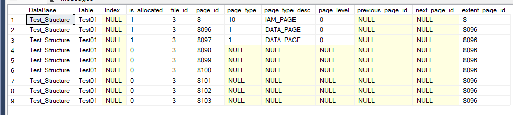

# Function to get the list of all table's data pages

``` SQL
CREATE FUNCTION udfInfoDataPage (@DataBaseName sysname, @TableName sysname)
RETURNs TABLE

as
Return

SELECT 
    DB_NAME(PA.database_id) as [DataBase], 
    OBJECT_NAME(PA.object_id) as [Table],
	SI.Name [Index],    
	is_allocated, 
	allocated_page_file_id as [file_id],     
	allocated_page_page_id as [page_id], 
	page_type,
	page_type_desc,  
	page_level, 
	previous_page_page_id as [previous_page_id],  
	next_page_page_id as [next_page_id] ,
	extent_page_id
FROM 
    sys.dm_db_database_page_allocations 
    (DB_ID(@DataBaseName),    
    OBJECT_ID(@TableName),NULL, NULL, 'DETAILED') PA      
LEFT OUTER JOIN 
    sys.indexes SI     
    ON SI.object_id = PA.object_id                   
    AND SI.index_id = PA.index_id
;

GO
```

