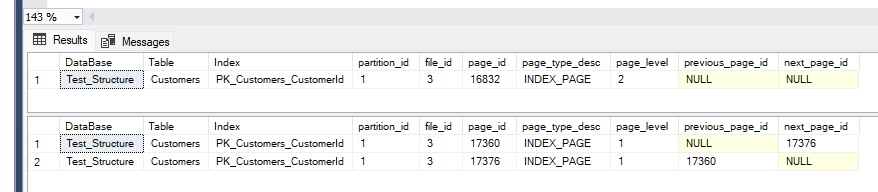

# Function to return the Page Id of the  pages in Root and Intermediate levels of an index

## Code

``` SQL
CREATE FUNCTION util.GetPagesOfBPlusTreeLevel(
    @DBName VARCHAR(100), @TableName VARCHAR(100) = NULL, @IndexName VARCHAR(100) = NULL, 
    @PartionId INT = NULL, @MODE VARCHAR(20), @BPlusTreeLevel VARCHAR(20) 
)
RETURNS
@IndexPageInformation TABLE (
    [DataBase] VARCHAR(100), [Table] VARCHAR(100), [Index] VARCHAR(100), 
    [partition_id] INT, [file_id] INT, [page_id] INT, page_type_desc VARCHAR(100), 
    page_level INT, [previous_page_id] INT, [next_page_id] INT)
AS
BEGIN
 
    DECLARE @MinPageLevelId INT = 0 , @MaxPageLevelId INT = 0, @IndexId INT = NULL
         
    SELECT  @IndexId = index_id
    FROM sys.indexes
    WHERE OBJECT_NAME(object_id) = @TableName AND name = @IndexName
 
    IF @IndexId IS NULL
        RETURN
     
    IF @BPlusTreeLevel IN ('Root', 'Intermediate')  
    BEGIN  
        SELECT  @MaxPageLevelId = (CASE WHEN  @BPlusTreeLevel ='Intermediate' THEN MAX(page_level) - 1 ELSE MAX(page_level) END), 
                @MinPageLevelId = (CASE WHEN  @BPlusTreeLevel ='Intermediate' THEN 1 ELSE MAX(page_level) END)
        FROM sys.dm_db_database_page_allocations 
            (DB_ID(@DBName), OBJECT_ID(@TableName), @IndexId, @PartionId, 'DETAILED') PA
                    LEFT OUTER JOIN sys.indexes SI 
                ON SI.object_id = PA.object_id AND SI.index_id = PA.index_id
        WHERE is_allocated = 1 AND page_type in (1,2)  -- INDEX_PAGE and DATA_PAGE Only
 
        IF @MaxPageLevelId IS NULL OR @MaxPageLevelId = 0 
            RETURN
    END
  
    INSERT INTO @IndexPageInformation
    SELECT DB_NAME(PA.database_id) [DataBase], OBJECT_NAME(PA.object_id) [Table], SI.Name [Index], 
        [partition_id], allocated_page_file_id [file_id],  allocated_page_page_id [page_id], page_type_desc, 
        page_level, previous_page_page_id [previous_page_id], next_page_page_id [next_page_id]
    FROM sys.dm_db_database_page_allocations 
            (DB_ID(@DBName), OBJECT_ID(@TableName), @IndexId, @PartionId, 'DETAILED') PA
             LEFT OUTER JOIN sys.indexes SI 
            ON SI.object_id = PA.object_id AND SI.index_id = PA.index_id
    WHERE is_allocated = 1 AND page_type in (1,2) -- INDEX_PAGE and DATA_PAGE Only
            AND page_level between @MinPageLevelId AND @MaxPageLevelId
    ORDER BY page_level DESC, previous_page_page_id
 
    RETURN
END
;

GO
```

## Example

Index *PPK_Customers_CustomerId* on the table *Customers* in *Test_Structure* database with 3 levels

``` SQL
SELECT * 
FROM util.GetPagesOfBPlusTreeLevel      
('Test_Structure', 'Customers',
 'PK_Customers_CustomerId',
  NULL, 'DETAILED', 'Root') ;
GO

-- Pagine indice livello intermedio
SELECT * FROM util.GetPagesOfBPlusTreeLevel      
('Test_Structure', 'Customers',       
'PK_Customers_CustomerId', 
NULL, 'DETAILED', 'Intermediate');
```

Root Page = 16832

Intermediate pages = 17360, 17376


