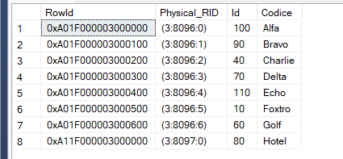

# Procedure to get RowId of each record in a Table

## Code

``` SQL
create procedure uspRowInfo @tabella sysname, @pageno varchar(8) = null
as

declare @sql varchar(8000);
declare @filtro varchar(200) =' ';

IF @pageno is not null
BEGIN
    set @filtro = ' where sys.fn_PhysLocFormatter (%%physloc%%) like ''%' + @pageno + '%'' '
END


set @sql = 
'select 
    %%physloc%% as RowId, 
    sys.fn_PhysLocFormatter (%%physloc%%) AS Physical_RID, 
    *
from ' + @tabella + @filtro + ' order by 2;'

Exec (@sql)
;
GO
```

## Example

``` SQL
select * from dbo.Test01;

exec util.RowInfo 'Test01';
```


