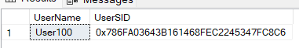
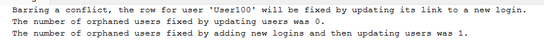

# Orphan Users

<https://learn.microsoft.com/en-us/sql/relational-databases/system-stored-procedures/sp-change-users-login-transact-sql>

Orphaned users in SQL Server occur when a database user is based on a login in the master database, but the login no longer exists in master.

## Use of **sp_change_users_login** procedure

### List of Orphaned users in a database

``` SQL
-- execute on database with Orphan Users

-- Get list of Orphan Users
EXEC sp_change_users_login 'report'
GO
```

### Fix Orphan Users

The **Auto_Fix** option will attempt to map the orphaned user to a login with the same name. If a login with the same name doesn't exist, it will create a new login.

If you want to map the orphaned user to a different login, you can use the **Update_One** option:

```sql
-- Auto-fix the orphaned user
EXEC sp_change_users_login 'Auto_Fix', 'YourUser';

-- Map the orphaned user to a different login
EXEC sp_change_users_login 'Update_One', 'YourUser', 'YourLogin';

```

## List of all orphan users in all databases

```sql
DECLARE @SQL nvarchar(2000)
DECLARE @name nvarchar(128)
DECLARE @database_id int

SET NOCOUNT ON;

IF NOT EXISTS 
    (SELECT name FROM tempdb.sys.tables WHERE name like '%#orphan_users%')
BEGIN
    CREATE TABLE #orphan_users
        (
        database_name nvarchar(128) NOT NULL,
        [user_name] nvarchar(128) NOT NULL,
        drop_command_text nvarchar(200) NOT NULL
        )
END

CREATE TABLE #databases 
(
    database_id int NOT NULL
    , database_name nvarchar(128) NOT NULL
    , processed bit NOT NULL
)

INSERT
    #databases 
    ( database_id
    , database_name
    , processed )
SELECT 
    database_id
    , name
    , 0 
FROM 
    master.sys.databases 
--WHERE 
--    name NOT IN 
--    ('master'
--    , 'tempdb'
--    , 'msdb'
--    , 'distribution'
--    , 'model')

WHILE (SELECT COUNT(processed) FROM #databases WHERE processed = 0) > 0
BEGIN
    SELECT TOP 1
        @name = database_name,
        @database_id = database_id
    FROM #databases
    WHERE processed = 0
    ORDER BY database_id

    SELECT @SQL =

'USE [' + @name + '];
INSERT INTO #orphan_users (database_name, user_name, drop_command_text)
SELECT 
    DB_NAME()
    , u.name
    , ' + '''' 
    + 'USE [' + @name + ']; ' 
    + 'DROP USER [' 
    + '''' + ' + u.name 
    + ' + '''' + '] ' 
    + '''' + '
FROM
    master..syslogins l
RIGHT JOIN 
    sysusers u 
ON l.sid = u.sid
WHERE   
    l.sid IS NULL
AND issqlrole <> 1
AND isapprole <> 1
AND ( u.name <> ' + '''' + 'INFORMATION_SCHEMA' + ''''
        + ' AND u.name <> ' + '''' + 'guest' + ''''
        + ' AND u.name <> ' + '''' + 'dbo' + ''''
        + ' AND u.name <> ' + '''' + 'sys' + ''''
        + ' AND u.name <> ' + '''' + 'system_function_schema' + '''' + ')'

    PRINT @SQL;

    EXEC sys.sp_executesql @SQL

    UPDATE 
        #databases 
    SET 
        processed = 1 
    WHERE 
        database_id = @database_id;
END

SELECT 
    database_name
    , [user_name]
    , drop_command_text 
FROM 
    #orphan_users 
ORDER BY 
    [database_name]
    , [user_name];

DROP TABLE #databases;
DROP TABLE #orphan_users;

SET NOCOUNT OFF;
GO
```

## Complete Example

```sql
drop database if exists TestOrphanUser;
GO

-- Create database for testing
create database TestOrphanUser;
GO

-- Create Login and User
USE Master
GO

create login User100 with password = 'VictorTango21';
--create user User100 from login User100;
GO

USE TestOrphanUser
GO

create user User100 from login User100;
GO

-- drop Login from Master
USE Master
GO

drop login User100;
GO


USE TestOrphanUser
GO
-- User100 now is an orphan user
EXEC sp_change_users_login 'report'
GO
```



```sql
-- Auto-fix the orphaned user- Create a new Login User100
EXEC sp_change_users_login 'Auto_Fix', 'User100', null, 'VictorTango21';
GO
```



```sql
-- There is no orphan users
EXEC sp_change_users_login 'report'
GO

-- drop Login from Master
USE Master
GO
drop login User100;
GO
create login User900 with password = 'PapaLima34';
GO

USE TestOrphanUser
GO
-- User100 is again an orphan user
EXEC sp_change_users_login 'report'
GO

-- Map the orphaned user100 to the login User900 
EXEC sp_change_users_login 'update_one','User100','User900'
GO
```
