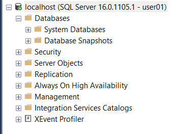
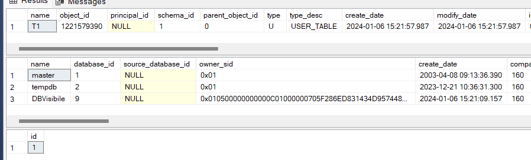
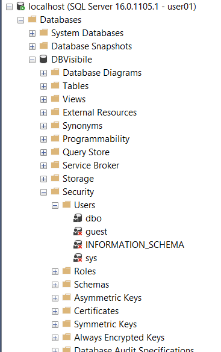

# Give a user the visibility to only a database

Code to permit to a user to see only a DB

## Set the enviroment

``` SQL
USE master
GO

drop database if exists DBVisibile;
GO

IF EXISTS (SELECT 1 FROM sys.syslogins WHERE name = 'user01')
BEGIN
    DROP LOGIN user01;
END

-- create user with limited visibility
create login user01 with password = 'LimaPoldo34!';
GO

-- Deny the user the ability to view any database
REVOKE VIEW ANY DATABASE  TO user01;
DENY VIEW ANY DATABASE TO user01;
GO

-- create the TestDB. The only DB that is visibile to user01.
create database DBVisibile;
GO

USE DBVisibile;
GO

-- create a table to test
create table dbo.T1 (id int);
GO

insert into dbo.t1 values (1);
GO
```

## give permission to user: **first way**

``` SQL
USE DBVisibile;
GO

create user user01 from login user01;
GO

GRANT VIEW DEFINITION TO user01;
GO

GRANT SELECT to user01;
GO
```

User don't view any database



but could be use DBVisibile

``` SQL
EXECUTE AS USER = 'user01';

select * from sys.tables
select * from sys.databases
select * from dbo.T1

REVERT;
```



## give permission to user: **second way**

``` SQL
use DBVisibile
GO

-- the user must not be a database user of this database
drop user User01;
GO

-- the login became the DB Owner
ALTER AUTHORIZATION ON DATABASE::[DBVisibile] TO User01; 
GO

```

Now user01 see the database DBVisibile and it is the owner.


