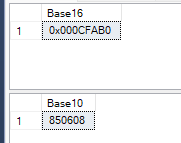

# Conversion TO and FROM Decimal, Hexadecimal and Binary numeric data

## Built in functions

``` SQL
-- Decimal to hex
SELECT CAST(850608 AS varbinary) as Base16;

-- Hex to decimal
SELECT CAST(0x000CFAB0 AS int) as Base10;

```



## Custom function

### Decimal TO Binary

``` SQL
CREATE FUNCTION [dbo].[DecimalToBinary]
(
    @Input bigint
)
RETURNS varchar(255)
AS
BEGIN

    DECLARE @Output varchar(255) = ''

    WHILE @Input > 0 BEGIN

        SET @Output = @Output + CAST((@Input % 2) AS varchar)
        SET @Input = @Input / 2

    END

    RETURN REVERSE(@Output)

END
```

### Binary TO Decimal

``` SQL
CREATE FUNCTION [dbo].[BinaryToDecimal]
(
    @Input varchar(255)
)
RETURNS bigint
AS
BEGIN

    DECLARE @Cnt tinyint = 1
    DECLARE @Len tinyint = LEN(@Input)
    DECLARE @Output bigint = CAST(SUBSTRING(@Input, @Len, 1) AS bigint)

    WHILE(@Cnt < @Len) BEGIN
        SET @Output = @Output + POWER(CAST(SUBSTRING(@Input, @Len - @Cnt, 1) * 2 AS bigint), @Cnt)

        SET @Cnt = @Cnt + 1
    END

    RETURN @Output

END

```

### Test

``` SQL
SELECT 
    dbo.DecimalToBinary(850608)as Base2,
    dbo.BinaryToDecimal('11001111101010110000') as Base10;
```

