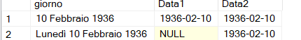

# Conversion to a Date from a String 


To convert a string to a date data type could use the convert function using the third parameter to specify the format of the string.


Baut the CONVERT function in SQL Server does not directly support converting date strings that include the day of the week.


In this case it's possible to use the parse function and the "AS DATE USING" option.

ES:

``` SQL
SET LANGUAGE Italian;
-- SET LANGUAGE English;

with cteA
as
(
SELECT *
FROM (VALUES
    ('10 Febbraio 1936'),
    ('Lunedì 10 Febbraio 1936')
) AS temp(giorno)
)

select 
	giorno, 
	try_CONVERT(date, giorno, 111) AS Data1,
	try_PARSE(giorno AS DATE USING 'it-IT') as Data2
from cteA;

```




This code gets a list of possible string formats for date 

``` SQL
SET LANGUAGE Italian;
--SET LANGUAGE English;


drop table if exists #dateFormats;
GO

DECLARE @counter INT = 0
DECLARE @date DATETIME = getdate();

CREATE TABLE #dateFormats (dateFormatOption int, dateOutput nvarchar(40))

WHILE (@counter <= 150 )
BEGIN
   BEGIN TRY
      INSERT INTO #dateFormats
      SELECT CONVERT(nvarchar, @counter), CONVERT(nvarchar,@date, @counter) 
      SET @counter = @counter + 1
   END TRY
   BEGIN CATCH;
      SET @counter = @counter + 1
      IF @counter >= 150
      BEGIN
         BREAK
      END
   END CATCH
END

SELECT * FROM #dateFormats
```