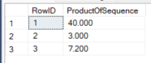
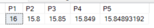

# Product of a Sequence

To obtain an aggregation similar to SUM() but where the item are multiplication and not added together is possible use the property of logarithms.

**LOG10(X) + LOG10(Y) = Z and 10 ** Z = X * Y**

``` SQL
CREATE TABLE #tmp (RowID INT, RowValue numeric(6,2)); 
GO
INSERT #tmp( RowID, RowValue ) VALUES  ( 1, 4); 
INSERT #tmp( RowID, RowValue ) VALUES  ( 1, 2); 
INSERT #tmp( RowID, RowValue ) VALUES  ( 1, 5); 
INSERT #tmp( RowID, RowValue ) VALUES  ( 2, 3); 
INSERT #tmp( RowID, RowValue ) VALUES  ( 2, 1); 
INSERT #tmp( RowID, RowValue ) VALUES  ( 3, 2.4); 
INSERT #tmp( RowID, RowValue ) VALUES  ( 3, 3); 
GO

SELECT * FROM #tmp;
GO

SELECT 
    RowID,
    POWER(10.000,SUM(LOG10(RowValue))) as ProductOfSequence
FROM #tmp t
GROUP BY RowID
;
GO

```



Note that number of decimal digits returned by POWER function depends by the number of decimal digit in the first parameter of Power function

``` SQL
select 
    power(10.,1.2) as P1,
    power(10.0,1.2) as P2,
    power(10.00,1.2) as P3,
    power(10.000,1.2) as P4,
    power(10.00000000,1.2) as P5;
GO
```


