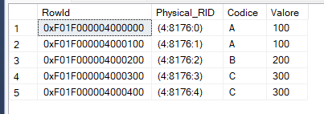
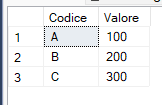

# Getting the unique internal ID of a record.

Using undocumented functions **%%physloc%%**  and **sys.fn_PhysLocFormatter**

Useful to remove duplicate records.

## Setting test environment

``` SQL
--Create table test
drop table if exists #testIdRecord
GO

create table #testIdRecord
(Codice varchar(10) not null, Valore int not null);
GO

-- some records test
insert into #testIdRecord 
values
('A',100), ('A',100),('B',200),('C',300),('C',300);

select * 
from #testIdRecord
order by Codice
;
```

## Using  **%%physloc%%**  and **sys.fn_PhysLocFormatter**

- %%physloc%% returns the internal unique identified of the record (rowid)
- sys.fn_PhysLocFormatter decoding Physical_RID value the of the RowId in the format (file:page:slot)
  
The value returned by %%physloc%% may change after each data insertion because there may be a physical reallocation


``` SQL
select 
    %%physloc%% as RowId, 
    sys.fn_PhysLocFormatter (%%physloc%%) AS Physical_RID, 
    Codice, Valore
from #testIdRecord
order by Codice;
```



## Removing duplicate records

``` SQL
-- deleting duplicate records
delete from #testIdRecord
where 
    %%physloc%% not in (select MIN(b.%%physloc%%)
    from    #testIdRecord b
    group by b.Codice)
;

--- check
select * 
from #testIdRecord
order by Codice;
GO
```

